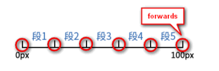

## 5.4 CSS动画
首先我们看一下以下的CSS代码
```CSS
.fade-in{
  animation: fadeIn .25s;
}
@keyframes fadeIn{
  from{opacity:0;}
  to{opacity:1;}
}
```
然后我们看一下代码中所包含的意思：
- `fadeIn`是我们自己定义的动画名称
- `.25s`是`0.25s`的简写，表示动画执行的时间
- `animation`是调用自定义动画规则的`CSS`属性
- `@keyframes`规则用来定义动画的关键帧

### 1.animation属性
`animation`属性的语法：
```CSS
animation: name | duration | timing-function | delay | iteration-count | direction | fill-mode | play-state

animation: fadeIn 3s ease-in 1s 2 reverse both paused;
```
同时`animation`属性也是多个CSS属性的缩写，其中包括：
| CSS属性                     | 说明                                                                                     |
| --------------------------- | ---------------------------------------------------------------------------------------- |
| `animation-name`            | 自定义动画名称                                                                           |
| `animation-duration`        | 动画的总时间长度                                                                         |
| `animation-timing-function` | 动画的速度曲线，或动画得过渡类型                                                         |
| `animation-delay`           | 动画的延迟时间(允许负值,-2s 使动画马上开始,但跳过 2 秒进入动画)                          |
| `animation-iteration-count` | 动画的播放次数                                                                           |
| `animation-direction`       | 是否循环交替反向播放动画                                                                 |
| `animation-fill-mode`       | 规定当动画不播放时（当动画完成时，或当动画有一个延迟未开始播放时），要应用到元素的样式。 |
| `animation-play-state`      | 动画是否正在运行或已暂停                                                                 |

`animation`属性支持同时应用多个动画规则
<br />
例如实现元素淡出和右侧划入同时进行的动画效果。正确做法是分隔设置，而不是设置在一个动画规则中

不推荐写法：
```CSS
.element {
  animation: fadeInSlideInRight .2s;
}
@keyframes fadeInSlideInRight {
  from {opacity: 0; transform:translateX(100%);}
  to{opacity: 1; transform:translateX (0%);}
}
```
推荐将代码分隔成多个独立的动画规则，CSS代码如下：
```CSS
.element {
 animation: fadeIn .2s, slideInRight .2s;
}
@keyframes fadeIn {
 from {opacity: 0;}
 to {opacity: 1;}
}
@keyframes slideInRight {
 from {
 transform: translateX(100%);
 }
 to {
 transform: translateX(0%);
 }
}
```

:::demo 这样做的好处在于我们自定义的动画规则可以在其他场合重复利用，例如希望弹框在出现的时候有淡出动画效果，并且我们无须再额外定义淡出动画规则，直接复用即可
  ```vue
    <template>
      <div class="example example1"></div>
      <div class="example example2" style="margin-top:10px;"></div>
    </template>
    <style>
      .example{
        width:80px;
        height:80px;
        border:40px solid deepskyblue;
        box-sizing:content-box;
        text-align:center;
        line-height:80px;
      }
      .example1{
        animation: fadeInSlideInRight .2s 10;
      }
      .example2{
        animation: fadeIn .2s 10, slideInRight .2s 10;
      }
      @keyframes fadeInSlideInRight {
        from {opacity: 0; transform:translateX(100%);}
        to{opacity: 1; transform:translateX (0%);}
      }
      @keyframes fadeIn {
        from {opacity: 0;}
          to {opacity: 1;}
        }
      @keyframes slideInRight {
        from {
          transform: translateX(100%);
        }
        to {
          transform: translateX(0%);
        }
      }
    </style>
  ```
:::

### 2.@keyframes规则的语法和特性
`@keyframes`规则的语法：
```CSS
@keyframes <keyframes-name> {
 <keyframe-block-list>
}
```
其中`<keyframe-block-list>`指的是定义的关键帧列表，每个关键帧由关键帧选择器和对应的CSS样式组成。

<span style="color:#f5222d;">关键帧选择器</span>用来指定当前关键帧在整个动画过程中的位置，其支持`from`、`to`这两个关键字和百分比值。
:::tip
from关键字等同于0%，to关键字等同于100%。
:::

```CSS
@keyframes fadeIn {
 from { opacity: 0; }
 to { opacity: 1; }
}
@keyframes fadeIn {
 0% { opacity: 0; }
 100% { opacity: 1; }
}
```
这两段CSS代码的作用是一样的

接下来，我们来看一下`@keyframes`规则中的一些特性

#### (1)起止关键帧可以不设置
例如定义淡出效果，可以这样设置：
```CSS
@keyframes fadeInBy {
  100% { opacity: 1; }
}
```
此时动画初始状态的透明度就是当前元素的透明度
```CSS
.element {
 opacity: 0.5;
}
.element.active {
 animation: fadeInBy .2s;
}
```

#### (2)关键帧列表可以合并
关键帧对应的CSS样式是一样的，则可以合并在一起书写
```CSS
@keyframes blink {
 0%, 50%, 100% { 
  opacity: 0; 
 }
 25%, 75% { 
  opacity: 1; 
 }
}
```

#### (3)不同的关键帧选择器是无序的
虽然动画的执行是有顺序的，从0%到100%，但是在代码层面，不同的关键帧选择器是不分先后顺序的。
```CSS
@keyframes fadeIn {
  0% { opacity: 0; }
  100% { opacity: 1; }
}
@keyframes fadeIn {
  100% { opacity: 1; }
  0% { opacity: 0; }
}
```

#### (4)重复定义的关键帧不是完全被覆盖的
关键帧重复定义，则不同的CSS样式是累加的，而相同的CSS样式是后面的样式覆盖前面的样式，和普通的CSS选择器的样式计算规则一致。
```CSS
@keyframes identifier {
  50% { top: 30px; left: 20px; }
  50% { top: 10px; }
}
```
:::demo 最终在50%这一帧用来动画的CSS样式是top:10px和left:20px。
  ```vue
    <template>
      <div class="example example3">
        <span>内容</span>
      </div>
    </template>
    <style lang="scss">
      .example3{
        position: relative;
      }
      .example3 span{
        position:absolute;
        line-height: normal;
        top:0;
        left:0;
        animation: identifier .2s 15;
      }
      @keyframes identifier {
        50% { top: 30px; left: 20px; }
        50% { top: 10px; }
      }
    </style>
  ```
:::

#### (5)关键帧中的样式可以不连续
前后关键帧的CSS属性无须保持一致
```CSS
@keyframes identifier{
  0% { top: 0; left: 0; }
  30% { top: 50px; }
  60%, 90% { left: 50px; }
  100% { top: 100px; left: 100%; }
}
```
这里，top属性应用动画的帧是0%、30%和100%，left属性应用动画的帧是0%、60%、90%和100%。

#### (6)!important无效
`!important`在`在@keyframes`规则是没有效果的，因为当CSS动画执行的时候，关键帧中定义的CSS优先级就是最高的。
```CSS
@keyframes identifier {
 0% { 
  top: 30px;
  /* 无效,动画不会执行 */
  left: 20px !important; 
 }
 100% { 
  top: 10px; 
 }
}
```

#### (7)优先级
:::demo 最终在50%这一帧用来动画的CSS样式是top:10px和left:20px。
  ```vue
    <template>
      <div class="img-box">
        <h4>style设置透明度</h4>
        
        <div>img元素出现了透明度从0到1的动画效果，这就表明@keyframes规则中的CSS优先级要比style属性设置的CSS属性的优先级要高。</div>
        <h4>style加!important设置透明度</h4>
        
        <div>代码表现的结论为img元素一直保持0.5的透明度。这就表明@keyframes规则中的CSS优先级小于!important语法中的CSS属性。</div>
      </div>
    </template>
    <style lang="scss">
      .img-box img {
          animation: fadeIn 1s 10;
      }
    </style>
  ```
:::

[dome示例](https://demo.cssworld.cn/new/5/4-1.php)


### 3.动画命名与`<custom-ident>`数据类型
按照规范，动画的名称可以是下面两种数据类型：`<string>` 和 `<custom-ident>`

- `<string>`数据类型
`<string>`数据类型表示需要带引号的字符串，CSS代码中的'...'和'Microsoft Yahei'就是`<string>`数据类型例如：
```
content: '...';
font-family: 'Microsoft Yahei'
```
因此，理论上CSS动画也是支持使用引号命名的动画效果的

:::demo
  ```vue
    <template>
      <div class="example example4">
        <span>内容</span>
      </div>
    </template>
    <style>
      .example4 {
        animation: 'hello world' 2s 15;
      }
      @keyframes 'hello world'{
        0% { opacity: 0; }
        100% { opacity: 1; }
      }
    </style>
  ```
:::

实际测试下来，仅Firefox浏览器支持`<string>`数据类型的CSS动画名称，Chrome浏览器和IE浏览器均认为这是不合法的语法。

- `<custom-ident>`数据类型

`<custom-ident>`数据类型的语法和CSS的标识符（例如，CSS属性就属于CSS标识符）很相似，区别就在于`<custom-ident>`数据类型是区分大小写的。

`<custom-ident>`数据类型可以由下面这些字符进行组合：
- 任意字母（a～z或A～Z）
- 数字（0～9）
- 短横线（-）
- 下划线（_）
- 转义字符（使用反斜杠`\`转义）
- Unicode字符（反斜杠`\`后面跟十六进制数字）。

由于`<custom-ident>`数据类型区分大小写，因此id1、Id1、ID1和iD1是不同的名称。而一些看起来差异很大的名称却是相同的，例如，`☺`和`\263a`其实是相同的，因此，下面CSS代码中的CSS动画是可以执行的：
:::demo
  ```vue
    <template>
      <div class="example example5">
        <span>内容</span>
      </div>
    </template>
    <style>
      .example5 {
        animation: ☺ 2s 15;
      }
      @keyframes \263a {
        0% { opacity: 0; }
        100% { opacity: 1; }
      }
    </style>
  ```
:::

接下来，说一下`<custom-ident>`数据类型的合法性。
1. 不能是CSS属性本身支持的关键字。如：`none`、`initial`、`inherit`等
2. 不能以十进制数字开头。如：`2333fadeIn`
3. 可以使用短横线作为开头，但是短横线后面不能是十进制数字
```
/* 合法 */
-fadeIn
/* 不合法 */
-2333fadeIn
```
4. 除短横线和下划线之外的英文标点字符（包括空格）都需要转义。
```
/* 合法 */
example\.png
hello\ world
/* 不合法 */
example.png
hello world
```
5. 连续短横线开头的名称在MDN文档中被认为是不合法的，但是作者测试了一下，除了IE浏览器不支持，其他浏览器都认为连续短横线的动画名称是合法的，因此，作者认为连续短横线开头的名称是合法的。
```
/* 除IE浏览器外均合法，即使和CSS自定义属性名称一致 */
.element {
 --fadeIn: 2;
 animation: --fadeIn 2s;
}
@keyframes --fadeIn {
 0% { opacity: 0; }
 100% { opacity: 1; }
}
```
6. 如果是Unicode编码转义字符，记得在后面添加一个空格
```
/* 合法 */
\233 haha
```

### 4.负延时与即时播放效果
`animation-delay`可以让动画延时播放
```
animation-delay: 300ms;
```
表示了动画延时`300ms`播放
:::tip
如果动画是无限循环的，设置的延时不会跟着循环，延时只有在第一次动画才会生效<br />
想要实现每次动画循环都有延时效果，常用的方法是在自定义动画关键帧处进行设置
:::
`animation-delay`属性比较经典的应用就是通过设置负值让动画即时播放，播放的位置为动画中间的某一阶段。
举一个音频波形动画的案例：

:::demo
  ```vue
    <template>
      <div class="loading">
        <i></i><i></i><i></i><i></i>
      </div>
    </template>
    <style>
      .loading{
        padding:10px;
      }
      .loading i {
        display: inline-block;
        border-left: 8px solid deepskyblue;
        height: 8px;
        animation: scaleUp 4s linear infinite alternate;
        margin: 0 1px;
      }
      .loading i:nth-child(2) {animation-delay: 1s;}
      .loading i:nth-child(3) {animation-delay: 2s;}
      .loading i:nth-child(4) {animation-delay: 3s;}
      @keyframes scaleUp {
        to { transform: scaleY(10); }
      }
    </style>
  ```
:::
然而，真正运行的时候却发现一个比较严重的问题，由于设置了延时，动画开始执行的时候，后面的矩形都是默认的高度，这显然不符合预期，矩形的初始高度应该参差不齐才对。

:::demo
  ```vue
    <template>
      <div class="loading1">
        <i></i><i></i><i></i><i></i>
      </div>
    </template>
    <style>
      .loading1{
        padding:10px;
      }
      .loading1 i {
        display: inline-block;
        border-left: 8px solid deepskyblue;
        height: 8px;
        animation: scaleUp 4s linear infinite alternate;
        margin: 0 1px;
      }
      .loading1 i:nth-child(2) {animation-delay: -1s;}
      .loading1 i:nth-child(3) {animation-delay: -2s;}
      .loading1 i:nth-child(4) {animation-delay: -3s;}
    </style>
  ```
:::
这样既保留了各个元素动画的时间差，又实现了动画效果的立即播放，且不会带来各个矩形初始状态尺寸相同的问题。

这里，提个问题，下面的代码的透明度变化是0.75→1还是0.25→1？

```CSS
.element {
  animation: fadeIn 1s linear -.25s;
}
@keyframes fadeIn {
  0% { opacity: 0; }
  100% { opacity: 1; }
}
```

在很多语言中，负值表示序列的序号前移，或者时间线往前，于是，很多人就认为`animation -delay:-.25s`就是在整个播放时间线上往前移动`0.25s`，因此透明度变化应该是0.75→1。但实际上并不是这样，其实透明度变化是0.25→1。

以上变化其实不难理解，关键点就是理解何为“延时”，例如`animation-delay:.25s`表示动画在`0.25s`之后从`0%`开始播放，那`animation-delay:-.25s`显然就表示在`0.25s`之前就已经从`0%`开始播放，即动画真正播放的时候动画已经执行了`0.25s`，因此，我们可见的变化就是0.25→1这段过程。

### 5.reverse和alternate关键字的区别和应用
`animation-direction`属性可以用来控制动画的方向，其本质上是通过控制`@keyframes`规则中定义的动画关键帧执行的方向来实现的。
```
animation-direction: normal; /* 初始值 */
animation-direction: reverse;
animation-direction: alternate;
animation-direction: alternate-reverse;
```

其中，`reverse`和`alternate`这两个关键字都有“相反”的意思，不同之处在于，`reverse`关键字是让每一轮动画执行的方向相反，而`alternate`关键字是让下一轮动画的执行方向和上一轮动画的执行方向相反。

:::demo
  ```vue
    <template>
      <div class="example example5"></div>
      <div class="example example6" style="margin-top:10px;"></div>
      <div class="example example7" style="margin-top:10px;"></div>
    </template>
    <style>
      .example5{
        animation: fadeInSlideInRight 4s 20 reverse;
      }
      .example6{
        animation: fadeInSlideInRight 4s 20 alternate;
      }
      .example7{
        animation: fadeInSlideInRight 4s 20 alternate-reverse;
      }
    </style>
  ```
:::

- `animation-direction`属性值如果是`normal`，那么动画执行的方向是0%→100%、0%→100%，每一轮的动画方向都是正常的。
- `animation-direction`属性值如果是`reverse`，那么动画执行的方向是100%→0%、100%→0%，每一轮的动画方向都是相反的。
- `animation-direction`属性值如果是`alternate`，那么动画执行的方向是0%→100%、100%→0%，每 轮的动画方向是相反的。
- `animation-direction`属性值如果是`alternate-reverse`，那么动画执行的方向是100%→0%，0%→100%， 每2n轮的动画方向是相反的。

#### (1)reverse关键字的应用场景
有的图形需要顺时针旋转，有的图形需要逆时针旋转，我们就不用去定义两个动画，直接用一个动画即可
```CSS
/* 不推荐 */
@keyframes spin {
 from { transform: rotate(0deg); }
 to { transform: rotate(360deg); }
}
@keyframes spin2 {
 from { transform: rotate(360deg); }
 to { transform: rotate(0deg); }
}
.turntable {
 animation: spin 5s 5;
}
.loading {
 animation: spin2 1s infinite;
}
```

```CSS
/* 直接用一个动画 */
.turntable {
 animation: spin 5s 5;
}
.loading {
 animation: spin 1s reverse infinite;
}
@keyframes spin {
 from { transform: rotate(0deg); }
 to { transform: rotate(360deg); }
}
```

#### (2)alternate关键字的应用场景
先看反例，实现一个钟摆运动
```CSS
/* 自定义动画关键帧 */
.clock-pendulum {
  transform-origin: top;
  animation: pendulum 2s infinite;
}
@keyframes pendulum {
  0%, 100% { transform: rotate(10deg); }
  50% { transform: rotate(-10deg); }
}
```
:::demo
  ```vue
    <template>
      <div class="clock-pendulum"></div>
    </template>
    <style>
      .clock-pendulum {
        width: 20px;
        height: 100px;
        background: radial-gradient(10px at left 50% bottom 10px, deepskyblue 100%, transparent 0) no-repeat center,
        radial-gradient(4px at 50% 4px, deepskyblue 100%, transparent 0) no-repeat center,
        linear-gradient(to right, currentColor, currentColor) no-repeat center;
        background-size: 100%, 100%, 2px 100%;
        margin: auto;
      }
      /* 动画相关 */
      .clock-pendulum {
        transform-origin: top;
        animation: pendulum1 2s infinite;
        }
      @keyframes pendulum1 {
        0%, 100% { transform: rotate(10deg); }
        50% { transform: rotate(-10deg); }
      }
    </style>
  ```
:::
乍一看好像效果还行，其实是有问题的，除了代码烦琐且需要额外计算之外，最大的问题在于运动效果并不准确，因为此时一个动画周期是10deg→−10deg→10deg。对于钟摆运动，元素两次到达0deg的位置时运动速度最快，但是目前的CSS时间函数是无法同时指定两处加速点的，因此，上面这种自以为是的用法是无论如何也不可能实现真实的钟摆运动的
:::demo
  ```vue
    <template>
      <div class="clock-pendulum clock-pendulum1"></div>
    </template>
    <style>
      /* 动画相关 */
      .clock-pendulum1 {
        transform-origin: center 4px;
        animation: pendulum 1s infinite alternate ease-in-out;
      }
      @keyframes pendulum {
        0%   { transform: rotate(-10deg); }
        100% { transform: rotate(10deg); }
      }
    </style>
  ```
:::
唯一且最佳的实现方法就是使用`alternate`关键字，同时使用`ease-in-out`作为时间函数，要知道钟摆运动是使用`ease-in-out`时间函数最具代表性的案例

#### (3)关于alternate-reverse
`alternate-reverse`关键字的作用是让动画第一次反向播放，然后不断来回播放。

### 6.动画播放次数可以是小数
动画播放的次数是可以任意指定的，很多人并不知道。我们可以使用`animation-iteration-count`属性任意指定动画播放的次数，甚至是小数。
```CSS
.element {
  animation: fadeIn 1s linear both;
  animation-iteration-count: 1.5;
}
@keyframes fadeIn {
  0% { opacity: 0; }
  100% { opacity: 1; }
}
```
动画播放的进度为0%→100%、0%→50%，也就是在第二轮播放的时候，播放到一半就会停止，此时元素的透明度是0.5。

#### (1)小数值的作用
小数值的应用场景虽然不多，但是还是有的，比如页面中有些元素处于禁用态，透明度只有40%，此时，使用完整的fadeIn动画就不合适（因为动画帧中的样式优先级太高，会覆盖40%透明度）。于是不少人会重新定义一个禁用元素的淡出动画：
```CSS
@keyframes disableFadeIn {
  0% { opacity: 0; }
  100% { opacity: .4; }
}
```
其实大可不必，还是使用fadeIn动画，只要把播放次数调整为小数即可。对于ease时间函数，透明度提高到40%只需要25%的完整动画时间，因此，我们只需要播放0.25次即可
:::demo
  ```vue
    <template>
      <p class="input--p"><input class="visible" value="可用"></p>
      <p class="input--p"><input class="visible" value="禁用" disabled></p> 
    </template>
    <style>
      .input--p input {
        opacity: 0;
        border: 1px solid darkgray;
      }
      .visible {
        animation: fadeIn 1s 1 both;
      }
      .visible:disabled {
        animation: fadeIn 1s 0.25 both;
      }
    </style>
  ```
:::
那如果我们只要淡出动画的中间部分，比如0.25→0.4，要怎么弄?
```CSS
.visible-middle-part {
 animation: fadeIn 1s -.25s .75;
}
```

#### (2)关于infinite
关键字属性值`infinite`表示无限，作用是让动画一刻不停地无限播放，钟摆运动或者loading旋转就属于这样的动画。

#### (3)关于值范围
`animation-iteration-count`的属性值不能是负数，否则会被认为不合法，但是可以是`0`，表示动画一次也不播放。因此，如果想要重置`animation`属性，可以使用`animation:0`，比使用`animation:none`的代码少。

### 7.forwards和backwards属性值究竟是什么意思
`animation-fill-mode`属性的字面意思是“动画填充模式”，主要用来定义动画在执行时间之外应用的值。
先看一下语法：
```
animation-fill-mode: none; /* 默认值 */
animation-fill-mode: forwards;
animation-fill-mode: backwards;
animation-fill-mode: both;
```
其中`none`是默认值，表示动画开始之前和动画结束之后不会对元素应用`@keyframes`规则中定义的任何样式。
```CSS
.element {
  opacity: 0.5;
  animation: fadeIn 2s 1s;
}
@keyframes fadeIn {
  0% { opacity: 0; }
  100% { opacity: 1; }
}
```
此时的.element元素的透明度变化过程如下：
1. 透明度0.5保持1s。
2. 透明度从0.5突变到0，然后透明度从0逐渐过渡到1，过程持续2s。
3. 透明度从1突变到0.5，并保持不变。

:::demo
  ```vue
    <template>
      <div class="example example8"></div>
    </template>
    <style>
      .example8{
        opacity: 0.5;
        animation: fadeIn 2s 1s;
      }
    </style>
  ```
:::

实际上，这里的`.element`元素的透明度无论设置为多少，都会有透明度突变的糟糕体验，这显然不是我们想要的，因此需要使用`animation-fill-mode`属性优化动画效果。

#### (1)forwards和backwards的含义

`forwards`是“前进”的意思，表示动画结束后（什么时候结束由`animation-iteration-count`属性决定），元素将应用当前动画结束时的属性值。
```CSS
.element {
  opacity: 0.5;
  animation: fadeIn 2s 1s forwards;
}
@keyframes fadeIn {
  0% { opacity: 0; }
  100% { opacity: 1; }
}
```
此时的`.element`元素在动画结束之后会使用`100%`这一帧的透明度属性值，因此透明度变化过程如下：
1. 透明度0.5保持1s。
2. 透明度从0.5突变到0，然后透明度从0逐渐过渡到1，过程持续2s。
3. 透明度一直保持为1（forwards的作用）。

:::demo
  ```vue
    <template>
      <div class="example example9"></div>
    </template>
    <style>
      .example9{
        opacity: 0.5;
        animation: fadeIn 2s 1s forwards;
      }
    </style>
  ```
:::

`backwards`是“后退”的意思，表示在动画开始之前，元素将应用当前动画第一轮播放的第一帧的属性值。
```CSS
.element {
  opacity: 0.5;
  animation: fadeIn 2s 1s backwards;
}
@keyframes fadeIn {
  0% { opacity: 0; }
  100% { opacity: 1; }
}
```
此时的`.element`元素在动画开始执行之前会使用0%这一帧的透明度属性值，因此透明度变化过程如下：
1. 透明度为0并保持1s不变（backwards的作用）
2. 透明度由0逐渐过渡到1，过程持续2s。
3. 透明度从1突变到0.5，并保持不变。

:::demo
  ```vue
    <template>
      <div class="example example10"></div>
    </template>
    <style>
      .example10{
        opacity: 0.5;
        animation: fadeIn 2s 1s backwards;
      }
    </style>
  ```
:::
总结一下：
`forwards`指动画向前，`backwards`指动画向后。
如果把时间画在一把尺子上，则动画所经过的时间就是这把尺子的一部分，如图红色部分所示，可以看到，动画向前的方向是动画的结束位置；动画向后的方向是动画的开始位置。也就是说`forwards`表示动画的结束，`backwards`表示动画的开始。

 

因此，`forwards`的“前进”指的是最后一帧继续前进的样式，`backwards`的“后退”指的是第一帧还要后退的样式。

#### (2)forwards和backwards的细节
由于动画的最后一帧是由`animation-direction`和`animation-iteration-count`属性共同决定的，因此`forwards`有时候对应的是`@keyframes`规则中的to或100%对应的帧，有时候对应的是@keyframes规则中的from或0%对应的帧

| `animation-direction`          | `animation-iteration-count` | 最后一个关键帧 |
| ------------------------------ | --------------------------- | -------------- |
| `normal`                       | 奇数或偶数（不包括0）       | 100%或to       |
| `reverse`                      | 奇数或偶数（不包括0）       | 0%或from       |
| `alternate`                    | 正偶数                      | 0%或from       |
| `alternate`                    | 奇数                        | 100%或to       |
| `alternate-reverse`            | 正偶数                      | 100%或to       |
| `alternate-reverse`            | 奇数                        | 0%或from       |
| `normal`或`alternate`          | 0                           | 0%或from       |
| `reverse`或`alternate-reverse` | 0                           | 100%或to       |

而`backwards`只取决于`animation-direction`的属性值，因为`backwards`设置的是动画第一次播放的第一帧的状态，与`animation-iteration-count`次数没有任何关系

| `animation-direction`          | 最后一个关键帧 |
| ------------------------------ | -------------- |
| `normal`或`alternate`          | 0%或from       |
| `reverse`或`alternate-reverse` | 100%或to       |

可以看出，其实`animation-iteration-count`的属性值为0的时候，`forwards`等同于`backwards`。

#### (3)both关键字

`animation-fill-mode:both`可以让元素的动画在延时等待时保持第一帧的样式，在动画结束后保持最后一帧的样式，适用于绝大多数的开发场景。

```CSS
.element {
  opacity: 0.5;
  animation: fadeIn 2s 1s both;
}
@keyframes fadeIn {
  0% { opacity: 0; }
  100% { opacity: 1; }
}
```
此时的.element元素的透明度变化过程如下：
1. 透明度为0并保持1s不变（等同于backwards的作用）。
2. 透明度从0逐渐过渡到1，时间持续2s。
3. 透明度保持为1不变（等同于forwards的作用）。

:::demo
  ```vue
    <template>
      <div class="example example11"></div>
    </template>
    <style>
      .example11{
        opacity: 0.5;
        animation: fadeIn 2s 1s both;
      }
    </style>
  ```
:::

还有一点小小的建议，依赖CSS动画保持元素的显隐状态有功能上的风险，例如动画如果没执行，元素就永远显示不出来。因此，常规的CSS语句里的元素样式也要同步变化，例如下面的元素显示是通过添加类名`.active`触发的，此时需要同时设置`opacity:1`
```CSS
.element {
  opacity: 0;
}
.element.active {
  /* opacity: 1记得写上*/
  opacity: 1;
  animation: fadeIn 2s 1s both;
}
@keyframes fadeIn {
  0% { opacity: 0; }
  100% { opacity: 1; }
}
```

### 8.如何暂停和重启CSS动画

使用animation-play-state属性可以控制CSS动画的播放和暂停，语法如下：

```CSS
/* 播放 */
animation-play-state: running;
/* 暂停 */
animation-play-state: paused;
```
只要设置animation-play-state的属性值为paused就可以让一个正在播放的CSS动画暂停。
:::demo
  ```vue
    <template>
      <div class="love" :class="{'stop':!isPlay}"></div>
      <button @click="handle">暂停</button>
    </template>
    <script setup>
      import {ref} from 'vue'
      const isPlay = ref(true)
      const handle = () => {
        isPlay.value = !isPlay.value
      }
    </script>
    <style>
      .love {
        width: 100px; height: 100px;
        background: url(https://demo.cssworld.cn/new/images/heart-animation.png) no-repeat;
        background-size: 2900%;
        animation: heart-burst steps(28) .8s infinite both;
      }
      .stop {
        animation-play-state: paused;
      }
      @keyframes heart-burst {
        0% {background-position: 0%;}
        100% {background-position: 100%;}
      }
    </style>
  ```
:::

相比传统的GIF动图，这种使用animation实现的动图效果，支持无损PNG，图像质量更高，而且可以随时播放和暂停。

配合animation-delay负值，动画暂停可以让元素停留在动画的任一时段，我们可以利用这一特性解决一些CSS难题。例如，希望设置50%透明度的deepskyblue色值就可以这样处理
:::demo
  ```vue
    <template>
      <div class="color">1111</div>
    </template>
    <style>
      .color {
        animation: opacityColor 1s -.5s linear paused;
      }
      @keyframes opacityColor {
        0% { color: transparent; }
        100% { color: deepskyblue; }
      }
    </style>
  ```
:::
此时`<div>`元素的`color`色值就是50%透明度的`deepskyblue`。

这里顺便讲一下如何重启CSS动画
:::demo
  ```vue
    <template>
      <div ref="example12" class="example example12 active" :class="{'active':isReset}"></div>
      <button @click="reset">重启</button>
    </template>
    <style>
      .example12.active {
        animation: fadeIn 2s 1s both;
      }
    </style>
    <script setup>
    import {ref} from 'vue'
      const example12 = ref(null);
      const reset = () => {
        example12.value.classList.remove('active');
        // 触发重绘
        example12.value.offsetWidth;
        example12.value.classList.add('active');
      }
    </script>
  ```
:::

如果不是重新执行动画，而是让已经暂停的动画继续播放，则设置`animation-play- state`属性值为`running`即可

### 9.深入理解steps()函数

`animation-timing-function`的属性值由`cubic-bezier()`函数和`steps()`函数组成。

`steps()`函数可以让动画效果不连续，就像楼梯，与之相对应的`cubic-bezier()`函数则更像是平滑的无障碍坡道

学习`steps()`函数有一定的难度，主要是容易分不清楚`start`和`end`。

常见的steps()函数用法示例如下:
```CSS
steps(5, end);
steps(2, start);

steps(number, position);
```
- `number`指数值，且是整数值，这个很好理解，表示把动画分成了多少段。
假设有如下`@keyframes`规则，定义了一段从`0 ～100px`的位移

```CSS
@keyframes move {
  0% { left: 0; }
  100% { left: 100px; }
}
```
同时number参数的值是5，则相当于把这段移动的距离分成了5段


- `position`指关键字属性值，是可选参数，表示动画跳跃执行是在时间段的开始还是结束。
其支持众多关键字值，这里先了解一下传统的`start`和`end`关键字。

- `start`表示在时间段的开头处跳跃。
- `end`表示在时间段的结束处跳跃，是默认值。

#### (1)深入理解start和end关键字
`steps()`函数本质上是一个阶跃函数，阶跃函数是一种特殊的连续时间函数，可以实现从0突变到1的过程。

如图所示的steps(1, start)、steps(1, end)、steps(3, start)、steps(3, end)就是阶跃函数。


通过分析图所示内容，我们可以得到对`start`和`end`关键字的进一步解释。

- start：表示直接开始，也就是时间段才开始，就已经执行了一个距离段。

动画执行的5个分段点是下面这5个，起始点被忽略，因为时间一开始直接就到了第二个点


- end：表示戛然而止，也就是时间段一结束，当前动画执行就停止。

于是，动画执行的5个分段点是下面这5个，结束点被忽略，因为在要执行结束点的时候已经没时间了


然而，上述的分析是站在函数的角度和时间的角度进行的，虽然仔细琢磨一下也能理解，但是由于这并不符合人的主观视角和实际感知，一段时间后，认知就会发生混乱。

混乱的原因在于认知失调。`steps(5)`是把动画时间段分成5段，对这个点的认识应该都没有问题，关键是对`steps(5, start)`的认识，看到这里是`start`，几乎所有人的第一反应就是动画应用的样式是对应时间段开始的样式，不然怎么叫作`“start”`呢？可现实真是残酷，`steps(5, start)`应用的样式不是5个时间段的`start`样式，而是5个时间段的`end`样式，例如`left:0`到`left:100px`的位移，最终元素表现出来的位移是`20px`、`40px`、`60px`、`80px`和`100px`。

`steps(5, end)`也是反直觉的表现，其应用的是5个时间段的`start`样式，而不是字面上的`end`样式，例如`left:0`到`left:100px`的位移，最终元素表现出来的位移是`0px`、`20px`、`40px`、`60px`和`80px`。

[dome示例](https://demo.cssworld.cn/new/5/4-7.php)

大家可以看到，以20px为一个分段，`start`的位置在分段的结束处，而`end`的位置在分段的开始处

因此，为了避免认知混乱，当需要用到`steps()`函数的时候，无须思考过于抽象的阶跃函数及其准确含义，只需要记住符合直觉认知的这么一句话：“一切都是反的。`start`不是开始，而是结 束；`end`不是结束，而是开始。”

#### (2)animation-fill-mode属性与steps()函数同时设置会怎样

`animation-fill-mode`属性和`steps()`函数同时使用，可能会影响元素的断点表现。

```CSS
animation: move 5s forwards steps(5, end);
```

`forwards`关键字会使动画停留在动画关键帧最后一帧的状态。于是，如图所示的6个分段点都会执行，整个动画停止在第六个分段点上，也就是由于设置了`animation-fill- mode`，因此虽然将时间分成了5段，但是视觉表现上却是元素总共移动了6个位置。



这显然不是我们想要的，怎么处理呢？可以减少分段个数和减小动画运动的跨度

```CSS
@keyframes move {
 0% { left: 0; }
 100% { left: 80px; }
}
```

也就是将终点从100px改成80px，同时将CSS调用改成：

```CSS
animation: move 5s forwards steps(4, end);
```

也就是将原来的`steps(5, end)`改成`steps(4, end)`，最后将100%这一帧交给`forwards`。

#### (3)step-start和step-end关键字

`step-start`和`step-end`是`steps()`函数的简化关键字，注意，是`step-*`，`step`后面没有`s`。`step-start`等同于`steps(1, start)`，表示“一步到位”；`step-end`等同于`steps(1, end)`或者`steps(1)`，表示“延时到位”。

之所以专门设置两个关键字`step-start`和`step-end`，不是因为这两个关键字常用，而是因为这两个关键字实用。

它们可以让动画按照设定的关键帧步进变化，特别适合非等分的步进场景。

例如实现一个打点动画

:::demo
  ```vue
    <template>
      <div>
        正在加载中<dot>...</dot>
      </div>
    </template>
    <style>
      dot {
        display: inline-block; 
        height: 1em; line-height: 1;
        vertical-align: -.25em;
        overflow: hidden;
      }
      dot::before {
        display: block;
        content: '...\A..\A.';
        white-space: pre-wrap;
        animation: dot 3s infinite step-start both;
      }
      @keyframes dot {
        33% { transform: translateY(-2em); }
        66% { transform: translateY(-1em); }
      }
    </style>
  ```
:::

在这个例子中，如果你想通过在`@keyframes`规则中设置好`0%`和`100%`的位置，再使用`steps(2)`或`steps(3)`进行位置划分实现这个效果，你会发现位置总是对不上。

其实完全不用这么麻烦的，手动设置好断点的位置，然后使用一个`step-start`关键字就搞定了，无须计算，无须微调，就算把`33%`改成`50%`功能也是正常的，只是打点速度不均匀而已，定位字符点绝对没问题。

这就是`step-start`和`step-end`关键字的精妙作用，可以让任意自定义的CSS关键帧步进呈现，很实用。

#### (4)新的jump-start、jump-end、jump-none和jump- both关键字

从2019年开始，Chrome浏览器和Firefox浏览器开始陆续支持`jump-`开头的用在`steps()`函数中的关键字。

目前`jump-`开头的这几个关键字的兼容性还不太好，在生产环境中还无法使用。

- jump-start：动画开始时就发生跳跃，和start关键字的表现一样。
- jump-end：动画结束时发生跳跃，和end关键字的表现一样。
- jump-none：动画开始时和结束时都不发生跳跃，然后中间部分等分跳跃。
- jump-both：动画开始时和结束时都发生跳跃。

假设时间函数分为3段，则`jump-start`、`jump-end`、`jump-none`和`jump-both`关键字对应的阶跃函数如图所示。


### 10.标签嵌套与动画实现的小技巧

遇到某些属性被占用，或者动画场景复杂的情况，可以试试使用标签嵌套来实现。例如，某个悬浮提示框的居中定位是使用`transform`属性实现的：
```CSS
.toast {
  position: absolute;
  left: 50%; top: 50%;
  transform: translate(-50%, 50%);
}
```

同时希望提示框出现的时候有放大的动画效果，也就是应用下面的CSS动画：

```CSS
@keyframes scaleUp {
  from { transform: scale(0); }
  to { transform: scale(1); }
}
```

很显然，此时`transform`属性冲突了，怎么办？很简单，使用标签进行嵌套就好了：
```vue
    <template>
      <div class="toast">
        <div class="content">提示内容</div>
      </div>
    </template>
    <style>
      .toast {
        position: absolute;
        left: 50%; top: 50%;
        transform: translate(-50%, 50%);
      }
      .content {
        color: #fff;
        background-color: rgba(0, 0, 0, .75);
        animation: scaleUp 300ms;
      }
    </style>
```

同样，我们还可以通过元素嵌套，分别应用动画实现更复杂的动画效果，典型的例子就是动画时间函数分解实现抛物线运动效果。

在页面中点击“加入购物车”按钮，就会看到有商品以抛物线运动的方式飞向购物车

[dome示例](https://www.zhangxinxu.com/study/201808/css3-parabola-shopping.php)

假设飞出去的元素的HTML代码结构如下：

```HTML
<div class="fly-item">
  
</div>
```

实现抛物线效果的关键CSS代码如下：

```CSS
.fly-item,
.fly-item > img {
  position: absolute;
  transition: transform .5s;
}
.fly-item {
  transition-timing-function: linear;
}
.fly-item > img {
  transition-timing-function: cubic-bezier(.55, 0, .85, .36);
}
```

其中，父元素`.fly-item`只负责横向线性运动，子元素``只负责纵向运动，只不过纵向运动是先慢后快的。

将纵向运动和横向运动合并，就产生了抛物线运动的视觉效果。大家可以想象一下扔铅球，铅球水平飞行的速度其实近似匀速，但是受到重力的影响，铅球下落的速度是越来越快的，于是抛物线效果就产生了。

类似的通过标签嵌套实现动画效果的例子还有很多，在这里就不一一列举了，重要的是思路和意识，希望大家遇到类似场景时能够想到这样的小技巧。