## 3.3.1 昙花一现的CSS多边框

```CSS

.example {
  border-right: 8px solid;
  border-right-colors: #555 #666 #777 #888 #999 #aaa #bbb #ccc;
}
```

这样一条渐变边框效果就出来了。可能是因为这一功能不实用，它已经从规范中被剔除了，现在没有任何浏览器支持这种语法。想要实现类似的效果，可以使用`box-shadow`或者`border-image`属性。


## 3.3.2 独一无二的border-image属性

为了方便接下来的学习，我们约定后续所有.example元素都包含下面的公共CSS代码
```CSS
  .example{
    width:80px;
    height:80px;
    border:40px solid deepskyblue;
  }
```
以及准备一张图片<br>

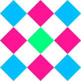
### border-image 用法
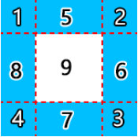 <br>
<sub>元素设置边框后的九宫格区域示意</sub>

* border-image属性的作用过程就是把图片划分为图3-17所示的9个区域的过程

:::demo
  ```vue
    <template>
      <div class="example example1"></div>
    </template>
    <style scoped>
      .example{
        width:80px;
        height:80px;
        border:40px solid deepskyblue;
        box-sizing:content-box;
        text-align:center;
        line-height:80px;
      }
      .example1{
        border-image: url(../.vitepress/assets/images/grid-nine.svg) 54;
      }
    </style>
  ```
:::

页面的渲染原理，该图展示了源图像的9个格子是如何分配到九宫格的各个区域中的。
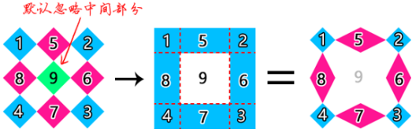 <br>
源图像的9个格子居然正好和边框划分的9个区域一一对应

`border-image`属性是多个CSS的缩写
| CSS属性               | 说明                                                                                                |
| --------------------- | --------------------------------------------------------------------------------------------------- |
| `border-image-source` | 图片来源                                                                                            |
| `border-image-slice`  | 对原始的图像进行划分，划分的方位和顺序同margin属性、padding属性一样，遵循上、右、下、左的顺序       |
| `border-image-width`  | 控制九宫格第一区到第八区的尺寸                                                                      |
| `border-image-outset` | 控制九宫格最中间第九区的尺寸                                                                        |
| `border-image-repeat` | 可以控制九宫格上、右、下、左4个区域（对应的区域序号是5～8，作者称这几个区域为平铺区）图形的平铺规则 |

#### 1.border-image-source
`border-image-source`属性的值是一个`<image>`数据类型，所以CSS中所有图像类型都可以作为边框图片，例如常见的渐变图像，因此border-image属性可以实现渐变边或者条纹边框效果。border-image-source属性的语法和`background-image`属性类似，

#### 2.border-image-slice
* 语法：
```CSS
border-image-slice: <number-percentage>{1,4} && fill?
```
表示支持1~4个数值或1~4个百分比，后面可以带一个关键字`fill`

让我们先看看以下栗子：
:::demo border-image-slice:20表示在距离源图像上方20px、距离源图像右侧20px、距离源图像下方20px、距离源图像左侧20px的地方进行划分
  ```vue
    <template>
      <div class="example example2"></div>
    </template>
    <style scoped>
      .example2{
        border-image-source: url(../.vitepress/assets/images/grid-nine.svg);
        border-image-slice:20;
      }
    </style>
  ```
:::
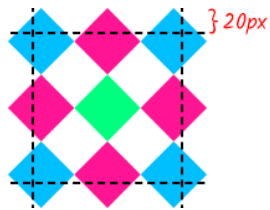  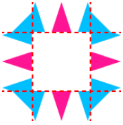<br>
此时4个边角区域只有很小的一部分被划分，而剩余的上、下、左、右区域会被拉伸

默认情况下，源图像划分的中心位置是不参与填充的。如果想要有填充效果，可以使用fill关键字
:::demo
  ```vue
    <template>
      <div class="example example3"></div>
    </template>
    <style scoped>
      .example3{
        border-image-source: url(../.vitepress/assets/images/grid-nine.svg);
        border-image-slice:33.33% fill;
      }
    </style>
  ```
:::
为了方便大家理解，这里有个简单的原理示意图
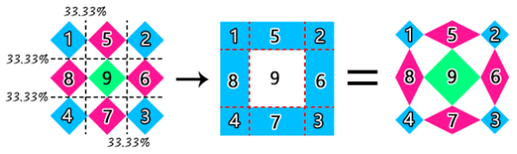 <br>

border-image-slice属性的默认值是100%
:::demo 相当于把上图左侧33.33%的线移动到右边缘，把右侧33.33%的线移动到左边缘，把上方33.33%的线移动到下边缘，把下方33.33%的线移动到上边缘。于是除了4个边角区域，其他区域都因为剪裁线发生反向交叉而不可见
  ```vue
    <template>
      <div class="example example4"></div>
    </template>
    <style scoped>
      .example4{
        border-image-source: url(../.vitepress/assets/images/grid-nine.svg);
        border-image-slice:100%;
      }
    </style>
  ```
:::

::: warning
如果border-image-source是渐变图像，则渐变图像的尺寸是按元素的border-box尺寸来计算的。
:::

#### 3.border-image-width
* 语法
```CSS
border-image-width:  [ <length> | <number> | <percentage> | auto ]{1,4}
```
表示支持1~4个数值或1~4个百分比，以及1~4个长度值，也可以使用关键字auto

针对`border-image-width`和`border-width`属性值类型的对比，有以下几点说明。
1. `border-image-width`属性支持使用数值作为属性值，这个数值会作为系数和`border-width`的宽度值相乘，最终的计算值作为边框图片宽度，也就是九宫格的宽度。
:::demo
  ```vue
    <template>
      <div class="flex-box">
        <div class="example example5">
          0.75
        </div>
        <div class="example example6">
          1
        </div>
        <div class="example example7">
          1.5
        </div>
      </div>
    </template>
    <style scoped>
      .flex-box{
        width:100%;
        display:flex;
        justify-content:space-between;
        align-items:center
      }
      .example5{
        border-image-source: url(../.vitepress/assets/images/grid-nine.svg);
        border-image-slice:54;
        border-image-width:0.75;
      }
      .example6{
        border-image-source: url(../.vitepress/assets/images/grid-nine.svg);
        border-image-slice:54;
        border-image-width:1;
      }
      .example7{
        border-image-source: url(../.vitepress/assets/images/grid-nine.svg);
        border-image-slice:54;
        border-image-width:1.5;
      }
    </style>
  ```
:::
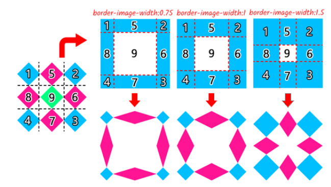 <br>

2. 如果border-image-width属性设置的是具体的长度值，如60px、5em等，则九宫格的宽度就和border-width属性没有关系了。
::: warning
但是，有一个特殊的情况，那就是在`border-width`的长度为`0`的时候。<br>
理论上来说，如果border-image-width的属性值是具体的长度值，此时就算将border-width属性设置为0，也应该可以渲染边框图片，但是在Chrome浏览器中，边框图片却消失了，而Firefox浏览器则没有这个问题。因此，如果我们希望边框宽度为0，且border-image属性能生效，可以试试将`border-width`属性的值设置为0.02px（不小于1/64像素）。
:::

3. `border-image-width`属性的百分比值是相对于元素自身的尺寸计算的，水平方位相对于宽度计算，垂直方位相对于高度计算。比如说：
:::demo 这段代码表示九宫格上下区域高度是50%，左右区域高度是25%
  ```vue
    <template>
      <div class="example example8">
      </div>
    </template>
    <style>
      .example8{
        border-image: url(../.vitepress/assets/images/grid-nine.svg) 54;
        border-image-width:50% 25%;
      }
    </style>
  ```
::: 
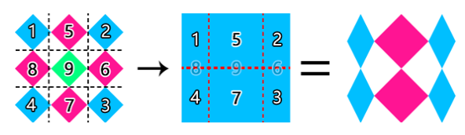 <br>

4. auto关键字，会使用`border-image-slice`属性划分的尺寸作为九宫格宽度值
:::demo 此时，`border-image-width`属性值等同于`border-image-slice`属性设置的54px；如果`border-image-slice`属性值是百分比值，则此时`border-image-width`的宽度值等于图片的对应方位的尺寸和33.33%的计算值
  ```vue
    <template>
      <div class="flex-box">
        <div class="example example9"></div>
        <div class="example example10"></div>
      </div>
    </template>
    <style>
      .example9{
        border-image: url(../.vitepress/assets/images/grid-nine.svg) 54;
        border-image-width:auto;
      }
      .example10{
        border-image: url(../.vitepress/assets/images/grid-nine.svg) 33.33%;
        border-image-width:auto;
      }
    </style>
  ```
:::

5. `border-image-width`属性和`border-width`属性都不支持负值。
6. `border-image-width`的宽度值很可能会超过元素自身的尺寸，看以下栗子：
4. auto关键字，会使用`border-image-slice`属性划分的尺寸作为九宫格宽度值
:::demo 这时候，`border-image-width`属性的宽度表现遵循“等比例原则”和“百分百原则”，也就是九宫格宽度不超过元素对应方向的宽度，同时保持设置的数值比例。
  ```vue
    <template>
      <div class="flex-box">
        <!-- border-image-width:100% 50% 等同于border-image-width:50% 25% -->
        <div class="example example11"></div>
        <!-- .example元素宽高都是160px，边框宽度是40px，则一个方位上的最大比例系数应该是4，
        此时垂直方向的总系数是6（4+2），则所有数值都应该乘以2/3（4/6） -->
        <!-- 所以，border-image-width:4 3 2 1应该等同于
        border-image-width:2.6667 2 1.3333 0.6667。 -->
        <div class="example example12"></div>
      </div>
    </template>
    <style>
      .example11{
        border-image: url(../.vitepress/assets/images/grid-nine.svg) 54;
        border-image-width: 100% 50%;
      }
      .example12{
        border-image: url(../.vitepress/assets/images/grid-nine.svg) 33.33%;
        border-image-width: 4 3 2 1;
      }
    </style>
  ```
:::

#### 4.border-image-outset
* 语法：
```CSS
border-image-slice:  [ <length> | <number> ]{1,4}
```
该属性支持1～4个数值，或者支持1～4个长度值，并且支持数值和长度值混合使用。
```CSS
/* 长度值 */
border-image-outset: 1rem;
/* 数值  */
border-image-outset: 1.5;
/* 垂直 | 水平 */
border-image-outset: 1 0.5;
/* 上 | 垂直 | 下 */
border-image-outset: 30px 2 40px;
/* 上 | 右 | 下 | 左 */
border-image-outset: 10px 15px 20px 25px;
```
:::demo
  ```vue
    <template>
      <div class="flex-box">
        <!-- 数值是相对于border-width计算 -->
        <!-- 由于.element元素的边框宽度是40px -->
        <div class="example example13"></div>
        <div class="example example14"></div>
      </div>
    </template>
    <style>
      .example13{
        border-image: url(../.vitepress/assets/images/grid-nine.svg) 54;
        border-image-outset: .5;
      }
      .example14{
        border-image: url(../.vitepress/assets/images/grid-nine.svg) 54;
        border-image-outset: 20px;
      }
    </style>
  ```
:::
::: tip
元素扩展了20px指的是九宫格中间区域的上、右、下、左这4个方位的尺寸都扩大了20px<br>
所以九宫格中间序号为9的区域的高和宽最终增加了40px
:::
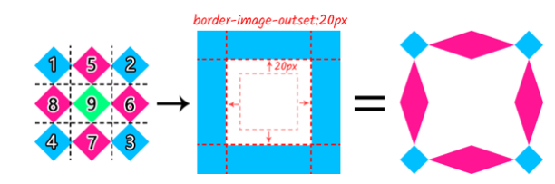 <br>

`border-image-outset`属性扩展出去的和`outline`属性扩展出去的九宫格区域的轮廓一样，不会影响布局，也不会响应鼠标经过行为或者点击行为。

#### 5.border-image-repeat
* 语法：
```CSS
border-image-repeat: [ stretch | repeat | round | space ]{1,2}
```
该属性最多只支持两个属性值同时使用。该属性强制规定水平方向的两条边的平铺规则必须是一样的，垂直方向的两条边的平铺规则也必须是一样的。

`border-image-repeat`属性可以控制九宫格上、右、下、左4个区域（对应的区域序号是5～8，作者称这几个区域为平铺区）图形的平铺规则

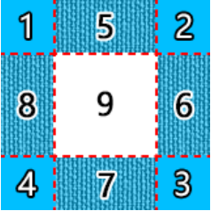 <br>

`border-image-repeat`属性支持的几个关键字属性值
* stretch：默认值，让源图像拉伸以充满显示区域。
* repeat：让源图像紧密相连平铺，保持原始比例，平铺单元在边界位置处可能会被截断。
* round：让源图像紧密相连平铺，适当伸缩，以确保平铺单元在边界位置处不会被截断。
* space：让源图像保持原始尺寸，平铺时彼此保持适当的等宽间隙，以确保平铺单元在边界位置处不会被截断；如果区域的尺寸不足以呈现至少一个源图像单元，则会以空呈现。目前在移动端有部分浏览器并不支持该关键字，因此这个关键字要谨慎使用。
:::demo
  ```vue
    <template>
      <div class="flex-box">
        <div class="example example15">stretch</div>
        <div class="example example16">repeat</div>
        <div class="example example17">round</div>
        <div class="example example18">space</div>
      </div>
    </template>
    <style>
      .example15{
        border-image: url(../.vitepress/assets/images/grid-nine.svg) 54;
        border-image-repeat: stretch;
      }
      .example16{
        border-image: url(../.vitepress/assets/images/grid-nine.svg) 33.33%;
        border-image-repeat: repeat;
      }
      .example17{
        border-image: url(../.vitepress/assets/images/grid-nine.svg) 54;
        border-image-repeat: round;
      }
      .example18{
        border-image: url(../.vitepress/assets/images/grid-nine.svg) 33.33%;
        border-image-repeat: space;
      }
    </style>
  ```
:::
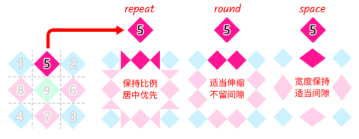 <br>

#### 6.border-image 缩写语法
* 语法：
```CSS
border-image: <'border-image-source'> || <'border-image-slice'> [ / <'border-image-width'> | / <'border-image-width'>? / <'border-image-outset'> ]? || <'border-image-repeat'>
```
语法被||符号分成了3部分，分别是资源引入、<font style="color:#f5222d;">尺寸控制</font>和平铺规则。
```CSS
/* slice: 54 */
border-image: 54;
/* slice: 54，width: 20px */
border-image: 54 / 20px;
/* slice: 54，outset: 20px */
border-image: 54 / / 20px;
/* slice: 54，width: 20px，outset: 20px */
border-image: 54 / 20px / 20px;
```
由于“尺寸控制”相关的3个CSS属性都支持4个方位的分别设置，因此border-image属性最复杂的缩写可能会有下面这么长。
:::demo 这时候，`border-image-width`属性的宽度表现遵循“等比例原则”和“百分百原则”，也就是九宫格宽度不超过元素对应方向的宽度，同时保持设置的数值比例。
  ```vue
    <template>
      <div class="flex-box">
        <div class="example example19"></div>
      </div>
    </template>
    <style>
      .example19{
        border-image: url(../.vitepress/assets/images/grid-nine.svg)  54 33.33% 33.33% 54 / 10px 20px 30px 1 / 0 30px 20px 10px round space;
      }
    </style>
  ```
:::

#### 7.border-image属性与渐变边框
:::demo
  ```vue
    <template>
      <div class="flex-box">
        <div class="example example20">
          上下渐变
        </div>
        <div class="example example21">
          径向渐变
        </div>
      </div>
    </template>
    <style>
      .example20{
        border-image: linear-gradient(deepskyblue, deeppink) 20 / 10px;
      }
      .example21{
        border-image: radial-gradient(deepskyblue, deeppink) 20 / 10px;
      }
    </style>
  ```
:::
:::demo 要想警示某一段内容存在风险，可以使用红色的条纹边框
  ```vue
    <template>
      <div class="flex-box">
        <div class="example border-stripe">
        </div>
      </div>
    </template>
    <style>
      .border-stripe{
        border: 12px solid;
        border-image: repeating-linear-gradient(-45deg, red, red 5px, transparent 5px, transparent 10px) 12;
      }
    </style>
  ```
:::

我们甚至可以用border-image属性重新定义元素的虚线边框，虚线的尺寸和虚实比例都可以随意控制
:::demo
  ```vue
    <template>
      <div class="flex-box">
        <div class="example border-dashed1">
          1:1的虚线
        </div>
      </div>
    </template>
    <style>
      .border-dashed1{
        border: 1px dashed deepskyblue;
        border-image: repeating-linear-gradient(135deg, deepskyblue, deepskyblue 5px, transparent 5px, transparent 10px) 1;
      }
    </style>
  ```
:::

有时候为了让渐变边框有圆角效果，我们的第一反应是使用border-radius属性，但事实是border-radius属性无法改变border-image属性生成的图形效果，我们需要使用其他的方法。

我们甚至可以用border-image属性重新定义元素的虚线边框，虚线的尺寸和虚实比例都可以随意控制
:::demo
  ```vue
    <template>
      <!-- 外层嵌套一层<div>元素，然后设置圆角和溢出隐藏 -->
      <div class="father">
        <div class="example example20">
          上下渐变
        </div>
      </div>
      <br/>
      <!-- 使用clip-path剪裁，该方法无须嵌套额外的元素 -->
      <div class="example example20 clip-path">
        上下渐变
      </div>
    </template>
    <style>
      .father{
        width:160px;
        border-radius: 10px;
        overflow: hidden;
      }
      .clip-path{
        clip-path: inset(0 round 10px);
      }
    </style>
  ```
:::

### border-image 少用的原因
1. border-image属性怪异的渲染机制，所以导致学习成本较高。而且很多时候该属性对源图像的规格和比例也有要求，这导致使用成本也比较高。
2. 对设计师而言，border-image属性的视觉表现和现实认知是不一致的，而设计师的视觉设计多基于现实认知，因此，设计师无法为border-image属性量身定制图形表现。
3. 当下的设计趋势是扁平化而非拟物化，边框装饰通常在项目中不会出现。
4. border-image属性怪异的渲染机制导致元素的4个边角成了4个尴尬的地方，实现的边框效果往往不符合预期，最终导致开发者放弃使用border-image属性。

### border-image与轮廓的模拟
CSS中共有 3 个属性可以实现对布局没有任何影响的轮廓扩展，分别是outline轮廓、box-shadow盒阴影和border-image边框图片。

比如，我们有个元素在被选中后外部有2px宽的深天蓝色轮廓
:::demo
  ```vue
    <template>
      <div class="example selected1">
      </div>
      <br/>
      <div class="example selected2">
      </div>
      <br/>
      <div class="example selected3">
      </div>
    </template>
    <style>
      .selected1{
        border: none;
        outline: 2px solid deepskyblue;
      }
      .selected2{
        border: none;
        box-shadow: 0 0 0 2px deepskyblue;
      }
      .selected3{
        border: .02px solid;
        border-image: linear-gradient(deepskyblue, deepskyblue) 2 / 2px / 2px;
      }
    </style>
  ```
:::

| 属性           | 支持渐变 | 支持模糊        | 支持圆角           | 间隙控制     | 方位控制 |
| -------------- | -------- | --------------- | ------------------ | ------------ | -------- |
| `outline`      | ✘        | ✘               | ✘（仅Firefox支持） | ✔（Edge15+） | ✘        |
| `box-shadow`   | ✘        | ✔               | ✔                  | ✘            | ✔        |
| `border-image` | ✔        | ✘（可渐变模拟） | ✘                  | ✔            | ✔        |

通过这个表格，我们可以得到以下结论：
* 如果需要轮廓带有渐变效果，一定是使用`border-image`属性。
* 如果需要轮廓效果是纯色，且4个角为直角，则优先使用`outline`属性；如果`outline`属性不能使用（如无障碍访问需要），则使用`box-shadow`属性；如果`box-shadow`属性已经有了其他样式，则使用`border-image`属性。
* 如果需要轮廓有圆角效果，则一定是使用box-shadow属性。
* 如果需要轮廓和元素之间还有一段间隙，则优先使用`outline`属性；如果`outline`属性不能使用，则使用`border-image`属性
* 如果需要轮廓只有一个方向，则不考虑`outline`属性。

::: tip
border属性不能写在border-image属性的下方。<br />
因为border属性的缩写中包含了border- image相关属性的信息。
:::
