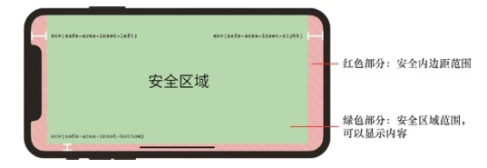
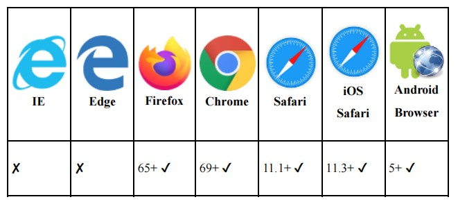

## 环境变量函数env()

环境变量函数`env()`规范的制定和兴起是由于iPhone X这类带有“刘海屏”和底部触摸条的移动设备的出现，如果按钮和底部触摸条在一起显示，就会出现交互冲突的问题，而`env()`函数可以让网页内容显示在设备的安全区域范围。

当然，环境变量函数`env()`的功能和作用绝不仅仅是设置安全边距这么简单，通过使用`env()`函数，很多原本需要特殊权限才可以访问的信息就可以作为全局变量在整个页面文档中使用。

只是，虽然`env()`函数的规划很长远，但是由于目前规范还只停留在第一阶段的草案阶段，内容很少，因此目前可以在实践中应用的就只有设置安全边距。

`env()`函数的语法和`var()`函数的语法很相似，它们的区别在于，`env()`函数可以用在媒体查询语句中，甚至用在选择器中

`var()`函数只能作为属性值或作为属性值的一部分

下面是`env()`函数的一些使用示意：
```CSS
/* 直接使用4个安全内边距值 */
env(safe-area-inset-top);
env(safe-area-inset-right);
env(safe-area-inset-bottom);
env(safe-area-inset-left);

/* 使用4个安全内边距值，同时设置兜底尺寸值 */
env(safe-area-inset-top, 20px);
env(safe-area-inset-right, 1em);
env(safe-area-inset-bottom, 0.5vh);
env(safe-area-inset-left, 1.4rem);
```

这里出现的`safe-area-inset-top`、`safe-area-inset-right`、`safe-area-inset-bottom`和`safe-area-insetleft`就是浏览器自己定义的属性名称，大家可以将其理解为`CSS`环境变量值，表示设备4个方向的安全内边距大小

 <br>

这里有两个细节：

1. 和通常的CSS属性不同，`env()`函数中的属性是区分大小写的，因此，下面CSS代码中的`padding-left`值一定是`50px`
```CSS
padding-left: env(SAFE-AREA-INSET-LEFT, 50px);
```
`SAFE-AREA-INSET-LEFT`是无法识别的属性，因此，会使用兜底的`50px`作为`padding-left`的属性值。

2. 要想使`safe-area-inset-*`属性表现出准确的间距，一定要确保`viewport`相关的`<meta>`信息如下:
```HTML
<meta name="viewport" content="viewport-fit=cover">
```
因此，如果当前的`iOS`的`Safari`浏览器的版本支持`env()`函数，使用了`env()`函数却没有效果，那么可以检查一下`<meta>`信息设置得是否正确。

 <br>

可以这么说，需要用到安全边距的设备一定支持`env()`函数，因此，大家放心使用该函数就好，不要顾及兼容性问题。
