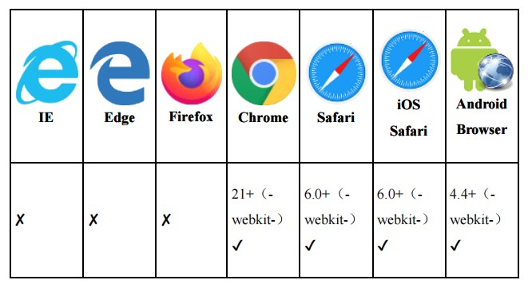

## image-set()函数与多倍图设置

`image-set()`函数的性质与`element()`函数、`cross-fade()`函数的性质是一样的

它们都属于`<image>`数据类型，不过就实用性而言，`image-set()`函数明显高了不只一个级别。

`image-set()`函数可以根据不同设备的屏幕密度或者分辨率来显示不同的背景图`background-image`或者遮罩图片`mask-image`等

```CSS
.example {
 background-image: image-set(url(1.jpg) 1x, url(1-2x.jpg) 2x,url(1-print.jpg) 600dpi);
}
```

这段CSS代码的作用是：如果屏幕是1倍屏，也就是设备像素比是`1∶1`的话，就使用`1.jpg`作为背景图；如果屏幕是2倍屏及以上，就使用`1-2x.jpg`作为背景图；如果设备的分辨率大于`600dpi`，就使用`1-print.jpg`作为背景图。

`dpi`表示每英寸点数。通常屏幕每英寸包含72点或96点

打印文档的`dpi`要大得多，一般`dpi`值在600以上，我们就可以认为是打印设备了

另外，`1x`、`2x`中的`x`其实是`dppx`的别称，表示每像素单位的点数，也可以理解为屏幕密度。

``元素有一个名为`srcset`的属性，这个属性与`image-set()`函数无论是名称还是语法都有相似之处
```HTML

```

不过`srcset`属性比较复杂，还包括`sizes`属性和`w`描述符。

下面通过一个案例进一步熟悉image-set()函数:

```CSS
.image-set {
  width: 128px; height: 96px;
  background: url(fallback.jpg);
  background: image-set(
  url(w128px.jpg) 1x, 
  url(w256px.jpg) 2x, 
  url(w512px.jpg) 3x);
  background-size: cover;
}
```
上面的CSS代码表示1倍屏加载`w128px.jpg`，2倍屏加载`w256.jpg`，3倍及以上倍数屏加载`w512.jpg`。

[dome示例](https://demo.cssworld.cn/new/7/5-1.php) <br/>

- 在普通的显示设备下加载的是128px规格的图片
- 如iPhone 6/7/8，则加载的是256px规格的图片
- iPhone 6/7/8 Plus是3倍屏，因此，如果使用iPhone 6/7/8 Plus模式预览，则加载的是512px规格的图片

 <br>

可以看到，所有移动端的常见浏览器均支持该函数

即便在桌面端浏览器中，`image-set()`函数也可以放心使用，不用担心会影响内容的呈现

因为它是一个渐进增强特性。实际开发时，在`image-set()`语句之前加一行`background:url()`语句兜底就可以了了，这样就算浏览器不支持`image-set()`函数，界面样式依然表现良好

当然，兼容性更好的做法还是使用`@media`规则，例如：
```CSS
@media (resolution: 2dppx) { 
  .example {
    background: url(1-2x.jpg);
  }
}
@media (min-resolution: 3dppx) { 
  .example {
    background: url(1-3x.jpg);
  }
}
```

虽然`image-set()`函数的设计初衷是好的，但是实用性很一般，因为在实际开发中往往会设置直接加载2倍图，1倍图是不加载的。

这样做一是因为现在流量便宜，二是因为无须准备多张不同尺寸的图片，可以减少开发和维护成本。

只有下面两种情况才需要用到image-set()函数
1. 不同屏幕密度下显示的是完全不同的图，而不是只有尺寸不一样的图。例如，在1倍屏下显示造型简单的图标，在多倍屏下显示细节丰富的图标。
2. 用户体验和流量收益足够明显的场景。例如类似WeChat这种用户基数很大的产品；或者给流量费用较高、信号较差的地区开发的产品

题外话：
作者为什么不用JS去参与css布局

JavaScript的主要缺点是功能耦合，不利于维护，后置执行可能会有体验问题：一旦JavaScript异常，布局会毁掉