## @media规则

`@media`规则是用来匹配不同设备的，例如，响应式布局中常用的宽度查询与适配

```CSS
aside {
  width: 200px;
  float: left;
}

/* 当设备屏幕的宽度小于480px的时候隐藏侧边栏 */
@media only screen and (max-width: 480px) {
  aside {
    display: none;
  }
}
```

实现的效果是：在设备屏幕宽度足够的时候，页面会显示侧边栏；在设备屏幕的宽度小于480px的时候，页面会隐藏侧边栏，便于主内容的呈现。

从`@media only screen and (max-width:480px)`中，可以看出写法规则由4个部分组成
- 媒体查询修饰符`only`
- 媒体类型`screen`
- 媒体条件`and`
- 媒体特性`max-width`

接下来，我们就对这四个部分逐一展开介绍。

### 1.媒体查询修饰符

CSS媒体查询有两个修饰符，一个是`only`，另一个是`not`，其中`not`表示否定的意思。

`not`的栗子：

```HTML
<!-- 这里需要注意的是not否定的不是媒体类型，而是后面整个查询语句
也就是说，不是否定screen，而是否定screen and(color) -->
<link rel="stylesheet" media="not screen and (color)" href="example.css" />
```

然后我们在看看`only`，它本身并没有任何效果，将其去掉或加上，最终效果是没有任何变化的。

那么，这个修饰符有什么用呢？其实，它在现在这个年代已经没有什么用了。在很早的时候，浏览器就已经开始支持`@media`规则了，当年它还被用来区分`IE7`浏览器和`IE8`浏览器。这些老旧的浏览器有一个“坏习惯”，它们会忽视无法识别的媒体条件和媒体特性

例如，会把`screen and (color)`识别为`screen`，这很容易产生致命的样式问题。于是，为了让老旧的浏览器干脆不要识别一些新的查询语句，就设计了`only`修饰符符，放在媒体类型的前面。

这样`only screen and (color)`查询语句中的CSS代码就再也不会被老旧的浏览器解析了，因为这些老旧的浏览器认为only是非法的。

今时不同往日，如今这些老旧的浏览器都已被淘汰，`only`修饰符就没有再使用的必要了。

### 2.媒体类型

对于媒体类型，我们现在只需要关系`screen`、`print`、`all`这3个媒体类型就可以了

对于曾经支持的`speech`、`tv`等8个媒体类型，大家直接忽略即可，目前在规范中已经将它们舍弃了，浏览器也已经放弃了对它们的支持。

例如，现在屏幕阅读器都是识别`screen`，而不是识别`speech`。

`print`查询中的CSS代码只会在打印和打印预览的时候生效；而在打印之外的场景均使用`screen`，因此，`screen`媒体类型最常用；`all`则表示匹配所有设备，无论是打印设备还是其他普通的现实设备。

来看一个例子。想要在打印的时候使页面的头部和尾部不参与打印，可以使用下面的CSS代码：
```CSS
@media print {
  header, footer {
    display: none;
  }
}
```

另外，我们可以使用逗号同时指定多个媒体类型
```CSS
@media screen, print { ... }
```

### 3.媒体条件

媒体条件有3个，即`not`、`and`和`or`。

`not`：表示否定某个媒体特性

例如`not (color)`表示非彩色设备。虽然规范文档中就是列举`not (color)`作为案例的，但是根据作者的测试，这里的`not`应该是作为修饰符而不是媒体条件起作用的，因为类似`screen not (color)`这样的语句是无效的。

and和or则是有效且常用的，前者表示条件同时满足，后者表示满足之一即可

```CSS
/* 如果设备更新频率慢，或者不支持鼠标行为 */
@media (update: slow) or (hover: none) {}

/* 宽度在320px～480px，同时分辨率是150dpi的设备 */
@media only screen 
 and (min-width: 320px) 
 and (max-width: 480px)
 and (resolution: 150dpi) {
  body { line-height: 1.4; }
}
```

### 4.媒体特性

媒体特性指的是对媒体特性的描述信息，包括浏览器、用户设备和使用环境等特性。

表格表示了一些可用的媒体特性

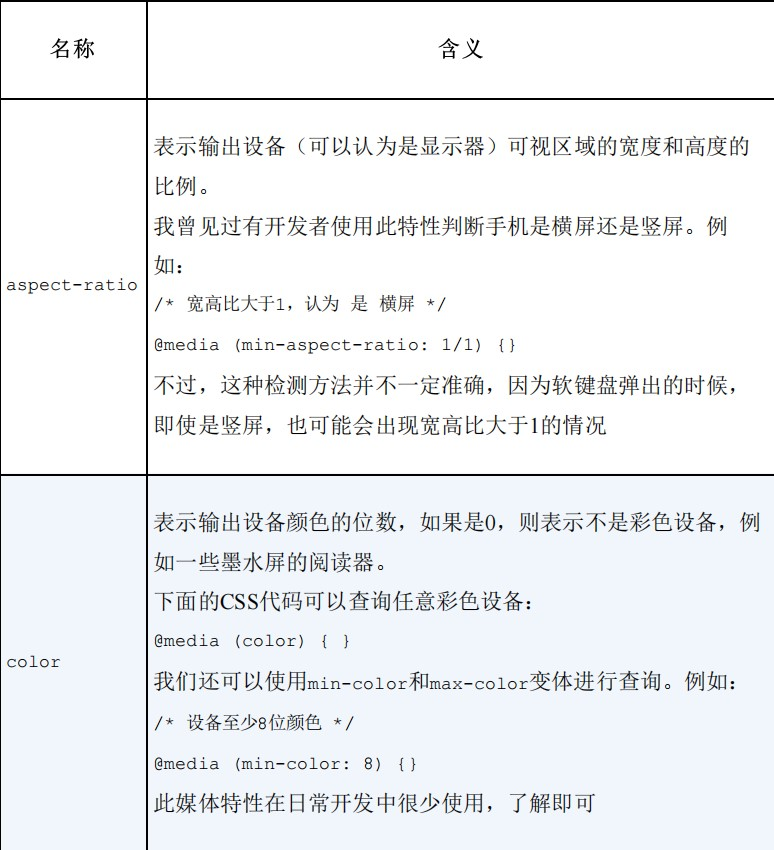 <br>

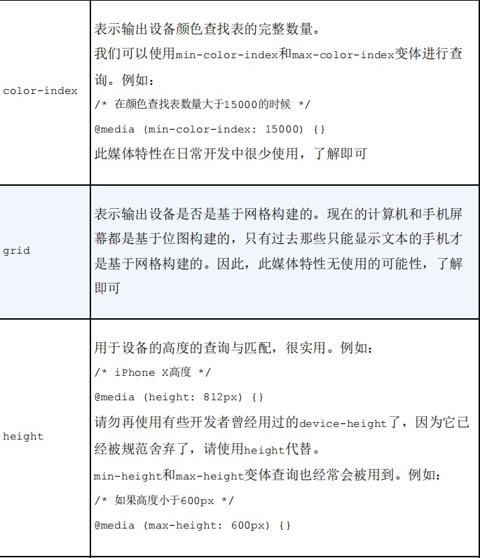 <br>

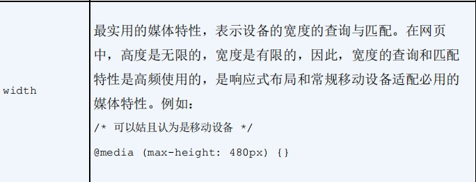 <br>

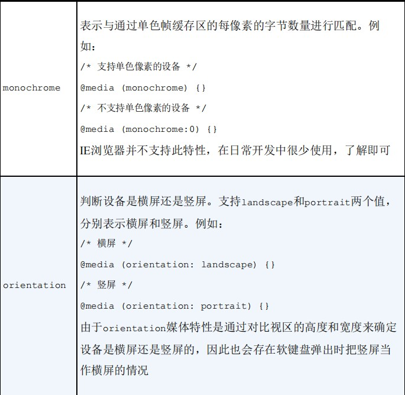 <br>

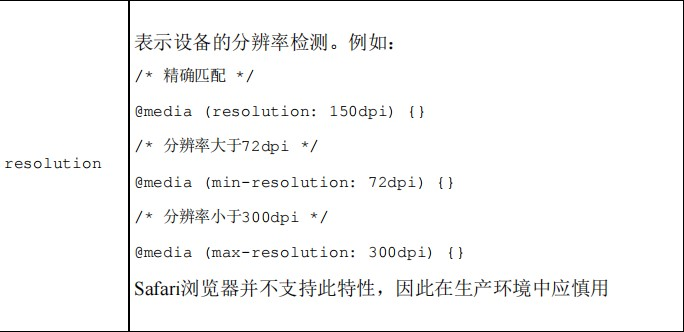 <br>

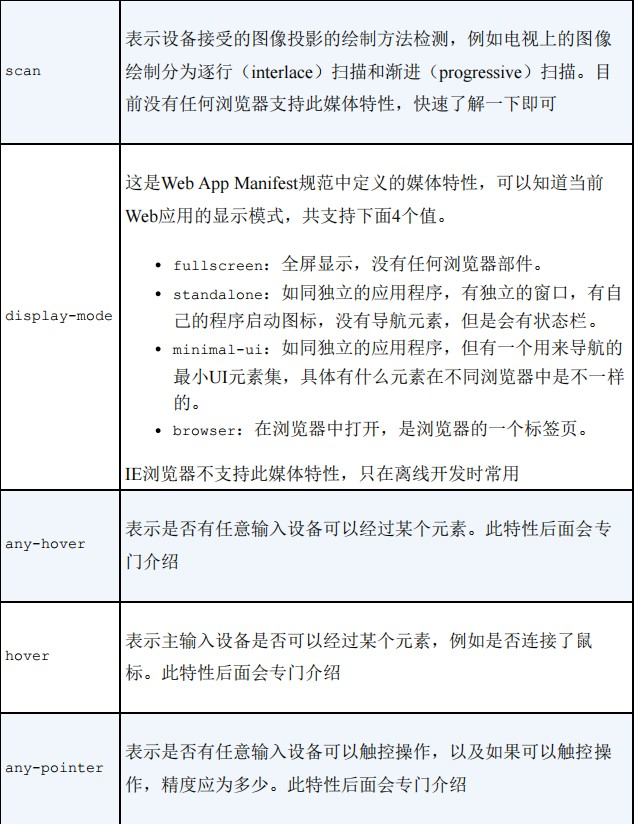 <br>

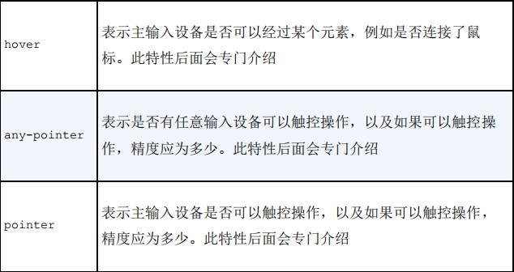 <br>

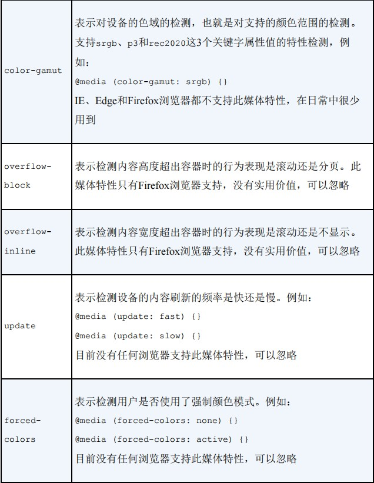 <br>

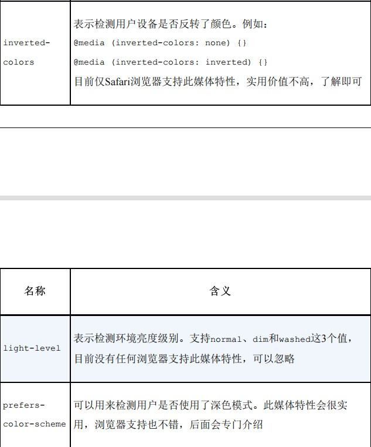 <br>

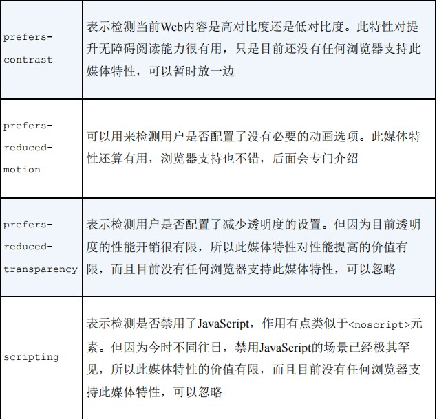 <br>

除了上述规范特性，各个浏览器还有一些私有的媒体特性，但大多数都不实用。

不过`device-pixel-ratio`媒体特性除外，`Chrome`和`Firefox`浏览器均支持它，调用它时应分别加上`-webkit-`私有前缀和`-moz-`私有前缀。

`device-pixel-ratio`表示设备像素比，可以将其理解为屏幕密度。由于这个媒体特性并不属于CSS规范，虽然目前兼容性还不错，但不建议使用，请使用`resolution`媒体特性代替

```CSS
/* 设备像素比等于2 */
@media (-webkit-device-pixel-ratio: 2) { ... }
/* 等同于 */
@media (resolution: 2dppx) { ... }

/* 设备像素比不小于2 */
@media (-webkit-min-device-pixel-ratio: 2) { ... }
/* 等同于 */
@media (min-resolution: 2dppx) { ... }

/* 设备像素比不大于2 */
@media (-webkit-max-device-pixel-ratio: 2) { ... }
/* 等同于 */
@media (max-resolution: 2dppx) { ... }
```

媒体特性虽然多，但大多数媒体特性都不实用，只有`width`和`height`媒体特性，以及宽高比和屏幕分辨率等媒体特性比较实用，不过它们也比较简单

## 对深色模式和动画关闭的支持检测

这节介绍两个最新规范制定的，浏览器已经支持的，且确实比较实用的媒体特性。

### prefers-color-scheme

可以用来检测当前网页是否处于深色模式（或称黑暗模式）中，其支持的参数值如下
- `no-preference`表示系统没有告知用户使用的颜色方案
- `light`表示系统倾向于使用浅色模式
- `dark`表示系统倾向于使用深色模式

使用示意如下：
```CSS
/* 深色模式 */
@media (prefers-color-scheme: dark) {
  body { background: #333; color: white; }
}

/* 浅色模式 */
@media (prefers-color-scheme: light) {
  body { background: white; color: #333; }
}
```

如果需要在`JS`代码中对系统的深浅主题进行判断，可以使用原生的`window.matchMedia()`方法:
```JS
// 是否支持深色模式
// 返回true或false
window.matchMedia("(prefers-color-scheme: dark)").matches;
```

下面介绍一个对现有网页快速进行深色模式改造的技巧:
```CSS
@media (prefers-color-scheme: dark) {
 body { 
    filter: invert(1) hue-rotate(180deg);
    background-color: #000;
 }
 img {
    filter: invert(1) hue-rotate(180deg);
 }
}
```

对浅色模式、文字颜色和背景色等直接使用滤镜进行反相，自然就变成深色模式了，无须逐个对颜色进行重置，一行简单的`filter:invert(1)`就可以搞定。不过对于图片元素，如果进行反相操作，效果会很奇怪。此时，可以再次反相，将图片还原成真实颜色

[dome示例](https://demo.cssworld.cn/new/7/1-1.php) <br/>

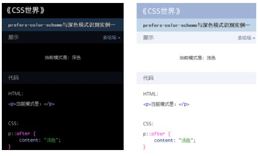 <br>

不过，需要提醒一下大家，`filter:invert(1)`这种“偷懒”的技巧只适合用于不太重要的页面。根据作者的实际开发经验，`filter`滤镜在`Safari`浏览器中会带来潜在的渲染问题。

### prefers-reduced-motion

用来检测操作系统是否设置了关闭不必要动画的操作，其支持的参数值如下

- `no-preference`表示用户没有通知系统任何首选项
- `reduced`表示用户已通知系统，他们更喜欢删除或者替换基于运动的动画，因为该类型动画会引发前庭功能紊乱患者的不适（类似晕车），或者一部分人就是单纯动画疲劳，也可能想要更省电

根据我查到的一些信息，关闭操作系统动画的用户并不少，尤其是对用户基数很大的产品而言。对于这部分用户，尤其是前庭功能紊乱的用户，在Web产品中进行相应的体验优化还是很有必要的。

其实，我们要做的事情很简单：如果用户选择了关闭动画，那么我们要让Web应用中的动画同步关闭。例如，弹框出现就不需要有弹一下的动画效果，评论框也不需要从下方出现，直接让评论框显示出来就可以

```CSS
@media (prefers-reduced-motion) {
  .example-1 {
    animation: none;
  }
  .example-2 {
    transition: none;
  }
}

/* 或者 */
@media (prefers-reduced-motion) {
  * {
    animation: none;
    transition: none;
  }
}
```

## 对鼠标行为和触摸行为的支持检测

先从一个例子说起。有这样一个交互效果：当鼠标经过图片的时候，在图片上方显示一段描述文字。这个交互效果可以使用:hover伪类轻松地实现。

:::demo
  ```vue
    <template>
      <div class="example example1"></div>
    </template>
    <style>
    .example{
        width:80px;
        height:80px;
        border:40px solid deepskyblue;
        box-sizing:content-box;
        text-align:center;
        line-height:80px;
      }
      .example1:hover{
        border-color:red;
      }
    </style>
  ```
:::

结果这个功能在移动端出现了问题。因为:hover伪类在移动端，尤其在iOS的Safari浏览器中的交互会很奇怪，可以触发但是不容易触发，而且触发后的hover状态不太容易消除，体验并不好。

所以，为了在移动端也能无障碍地实现这个交互效果，交互设计师决定让元素在移动端默认显示红色
```CSS
@media(max-width:480px){
  .example1{
     border-color:red;
  }
}
```
这个问题看起来是解决了，实际上却还有很多问题。例如，如果手机横屏了怎么办？使用iPad访问岂不是也不太容易显示图片信息？其实问题的本质在于，仅通过屏幕宽度判断是不是触屏设备是非常片面和不准确的，只能应付大部分场景，而不能准确覆盖所有场景。

这时候就可以用CSS世界新出现的支持检测鼠标行为和触摸行为的媒体特性。

### any-hover

用于测试是否有任意可用的输入装置可以悬停（就是hover行为）在元素上。

例如，鼠标这个输入装置就可以控制鼠标指针的位置，以及悬停在元素上。因此，下个不太严谨的结论，any-hover其实就是用来检测设备是否接入了鼠标的。

支持下面两个关键字属性值。
- `none`表示没有输入装置可以实现悬停效果，或者没有可以实现指向的输入装置。
- `hover`表示一个或多个输入装置可以触发元素的悬停交互效果。

回到一开始的案例，其实真正希望的是元素在不支持悬停效果的设备上显示，因此，代码改成如下：

:::demo
  ```vue
    <template>
      <div class="example example2"></div>
    </template>
    <style>
      .example2:hover{
        border-color:red;
      }
      @media(any-hover:none){
        .example2{
           border-color:red;
        }
      }
    </style>
  ```
:::

[dome示例](https://demo.cssworld.cn/new/7/1-2.php) <br/>

`any-hover`媒体特性被Edge16+浏览器支持，具体兼容性如表。该媒体特性在CSS新特性中算是兼容性不错的，考虑到`any-hover`媒体特性的作用是体验增强，因此在生产环境中大可放心使用，无须顾虑陈旧设备。

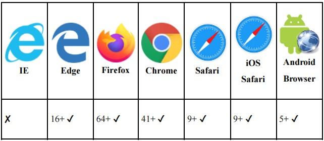 <br>

### hover

`hover`媒体特性的语法和作用与`any-hover`是一样的，两者的主要区别在于，`any-hover`检测任意输入装置，而`hover`只检测主要的输入装置。

属性值有以下几个。
- `none`表示主输入装置根本无法悬停或无法方便地悬停（例如，使用长点击来模拟悬停，而长点击这种交互并不方便），或者没有主输入装置。
- `hover`表示主输入装置可以触发元素的悬停交互。

将前面介绍的`any-hover`的案例的CSS代码改成下面这样，在绝大多数场景下的效果也是一样的

:::demo
  ```vue
    <template>
      <div class="example example3"></div>
    </template>
    <style>
      .example3:hover{
        border-color:red;
      }
      @media(hover:none){
        .example3{
           border-color:red;
        }
      }
    </style>
  ```
:::

由于`hover`媒体特性的兼容性更好，且从`Edge12+`就开始支持`hover`了，因此，如果是针对传统桌面端网页的体验优化，可以优先使用`hover`媒体特性。

### pointer和any-pointer

与`hover`和`any-hover`媒体特性相对应的还有`pointer`和`any-pointer`媒体特性。

`hover`是与悬停事件相关的，而`pointer`是与点击事件相关的。`pointer`和`any-pointer`媒体特性主要用于识别当前环境，判断是否可以非常方便地进行点击操作。

`any-pointer`支持3个属性值

- `none`表示没有可用的点击设备。
- `coarse`表示至少有一个设备的点击不是很精确。例如，使用手指操作手机就属于点击不精确。
- `fine`表示有点击很精准的设备。例如，用鼠标操作的计算机浏览器。

`pointer`也支持3个属性值

- `none`表示主输入装置点击不可用
- `coarse`表示主输入装置点击不精确
- `fine`表示主输入装置点击很精准

作者认为这两个媒体特性，最实用的场景其实并不是移动端，而是宽屏的桌面端网页。

因为随着物联网的不断发展，各种各样的触屏设备陆续出现，它们的屏幕尺寸都很大，例如汽车的中控屏、医院或银行的自助机屏幕和各种平板设备等。

在这些设备上浏览网页的时候，由于设备宽度足够大，一般在`1200px`以上，因此最终显示的是桌面端网页。

而我们在开发桌面端网页的时候，往往都是基于用户有一个灵敏的鼠标这样一个前提来设计和开发的，这就会导致在大屏触摸设备下体验较差。

这时候，`pointer和any-pointer`查询语法就很有用了。例如，点击不精确的时候让复选框尺寸变大（浏览器默认的复选框尺寸相当小）

```CSS
@media (pointer: coarse) {
  input[type="checkbox"] {
    width: 30px;
    height: 30px;
  }
}
```

[dome示例](https://demo.cssworld.cn/new/7/1-3.php) <br/>

`pointer`和`any-pointer`查询语法都是从`Edge12+`浏览器开始被支持的，也就是除了IE浏览器，两者在其他浏览器中都可以使用，兼容性算是不错的。

要体现出`CSS`和`JavaScript`不一样的价值，就要用CSS做出独一无二的用户体验。`prefers-color-scheme`、`prefers-reduced-motion`、`hover`、`pointer`等媒体特性就可以突显`CSS`的价值，大家一定要重视并在项目中积极实践，努力让Web产品的体验更加温暖。