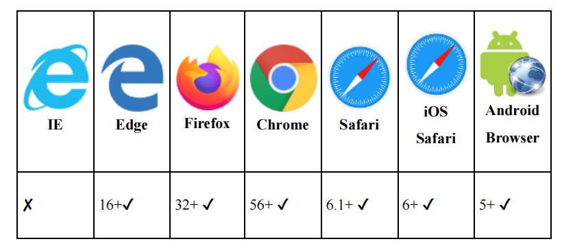
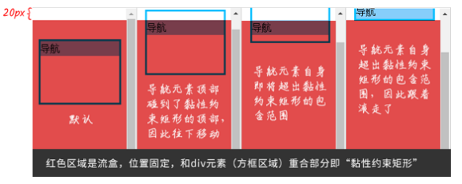
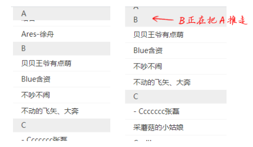

## 3.4 position属性的增强
本节主要介绍一个全新的position属性值——sticky（黏性定位），它的兼容性如下图：


### sticky的属性值与黏性定位
粘性定位的作用具体表现为：当导航元素在屏幕内的时候，导航元素滚动跟随；当导航元素就要滚出屏幕的时候，导航元素固定定位。<br />
[dome示例](https://demo.cssworld.cn/new/3/4-1.php)
```CSS
nav {
  position: -webkit-sticky;
  position: sticky;
  top: 0;
}
```
滚动页面，大家就会发现，当导航元素距离上边缘距离为0的时候，就粘在了上边缘，效果如同固定定位的效果。

:::tip
请注意，黏性定位效果底层的渲染规则和固定定位没有任何关系，而是相对定位的延伸。
:::

黏性定位和相对定位相似的地方:
* 元素发生偏移的时候，元素的原始位置是保留的。
* 创建了新的绝对定位包含块，也就是黏性定位元素里面如果有绝对定位的子元素，那这个子元素设置left属性、top属性、right属性和bottom属性时的偏移计算是相对于当前黏性定位元素的。
* 支持设置z-index属性值来改变元素的层叠顺序。
<br />
不同点：

* 偏移计算元素不一样。相对定位偏移计算的容器是父元素，而黏性定位偏移计算的元素是层级最近的可滚动元素（overflow属性值不是visible的元素）。如果一个可滚动元素都没有，则相对浏览器视窗进行位置偏移。
* 偏移定位计算规则不一样。黏性定位的计算规则比较复杂，涉及多个黏性定位专有的概念。
* 重叠表现不一样。相对定位元素彼此独立，重叠的时候表现为堆叠；但是黏性定位元素在特定布局结构下，元素重叠的时候并不是表现为堆叠，而是会有A黏性定位元素推开B黏性定位元素的视觉表现。

#### 1.可滚动元素对黏性定位的影响
通常的Web页面都是窗体滚动的，而黏性定位偏移计算的元素是层级最近的那个滚动元素。因此，如果黏性定位元素的某个祖先元素的overflow属性值不是visible，那么窗体滚动的时候就不会有黏性定位效果<br />
[dome示例](http://127.0.0.1:5500/example/%E5%8F%AF%E6%BB%9A%E5%8A%A8%E5%85%83%E7%B4%A0%E5%AF%B9%E9%BB%8F%E6%80%A7%E5%AE%9A%E4%BD%8D.html)
```HTML
<div>
  <nav></nav>
</div>
nav {
 position: sticky;
 top: 0;
}
```
此时滚动页面，`<nav>`元素是没有黏性效果的。
我们将`<div>`元素样式微调一下:
```CSS
div {
 height: 400px;
 overflow: auto;
}
div::after {
 content: '';
 display: block;
 height: 800px;
}
```
此时滚动`<div>`元素，大家就会发现`<nav>`元素没有跟着滚动，黏性定位效果表现得很好。
:::tip
因此，如果你的网页使用的是窗体滚动，又希望有黏性效果，那务必保证黏性定位元素的祖先元素中没有可滚动元素。
:::

#### 2.理解黏性定位的计算规则
[dome示例](https://demo.cssworld.cn/new/3/4-2.php) <br/>
如果黏性定位元素的父元素的高度和黏性定位元素的高度相同，则垂直滚动的时候，黏性定位效果是不会出现的。

黏性定位中有一个“流盒”（flow box）的概念，指的是黏性定位元素最近的可滚动元素的尺寸盒子

黏性定位中还有一个名为“黏性约束矩形”的概念，指的是黏性定位元素的包含块（通常是父元素）在文档流中呈现的矩形区域和流盒的4个边缘在应用黏性定位元素的left、top、right和bottom属性的偏移计算值后的新矩形的交集。

由于滚动的时候流盒不变，而黏性定位元素的包含块跟着滚动，因此黏性约束矩形随着滚动的进行是实时变化的。

假设我们的黏性定位元素只设置了top属性值，则黏性定位元素碰到黏性约束矩形的顶部时就开始向下移动，直到它完全被包含在黏性约束矩形中。

有一个页面是窗体滚动，包含`<div>`元素和`<nav>`元素，这两个元素是父子关系
```HTML
<div>
  <nav>导航</nav>
</div>
```
```CSS
div {
 height: 100px; 
 margin-top: 50px;
 border: solid deepskyblue;
}
nav {
 position: sticky;
 top: 20px;
 background: lightskyblue;
}
```
随着滚动的进行，`<nav>`元素的黏性约束矩形范围和实际的渲染表现如图
 <br />
由于`<nav>`这个黏性定位元素的top偏移是20px，因此，流盒矩形就是滚动窗口矩形再往下偏移20px，而`<nav>`这个黏性定位元素的包含块就是其父元素`<div>`（设置了边框）。

黏性约束矩形指的是流盒矩形和包含块的重叠区域，因此，图所示的黏性约束矩形就是红色区域和方框区域重叠的矩形区域。

在默认状态下，也就是图左一，由于<`div>`元素设置了`margin-top:50px`，因此，`<nav>`这个黏性定位元素的顶部距离黏性约束矩形的顶部还有33px（即30px的距离加上3px的边框高度），此时不会有黏性效果。随着浏览器页面滚动，`<nav>`元素的顶部和黏性约束矩形的顶部距离越来越小，直到距离为0。此时`<nav>`元素开始下移，将自己约束在黏性约束矩形范围内，如图左二所示。浏览器页面继续滚动，`<nav>`元素的底部也快要超出黏性约束矩形范围的限制了，如图右二所示。最终，`<nav>`元素的底部和黏性约束矩形范围的底部重合。由于黏性定位元素不能超出黏性约束矩形范围的限制，因此此时黏性效果失效，`<nav>`元素跟着一起滚走了，如图所示右一。

黏性定位元素的父元素和自身高度计算值一样的时候没有黏性效果。因为此时包含块高度和黏性定位元素的高度相同，这导致黏性约束矩形的最大高度和黏性定位元素的高度相同，黏性定位元素已经完全没有了实现黏性效果的空间。

#### 3.理解黏性定位的堆叠规则

[dome示例](https://demo.cssworld.cn/new/3/4-3.php)

黏性定位元素的偏移由容器决定，如果多个黏性定位元素在同一容器中，则这几个黏性定位元素会产生元素重叠的情况；如果黏性定位元素分布在不同的容器中，同时这些容器在布局上是上下紧密相连的，则视觉上会表现为新的黏性定位元素挤开原来的黏性定位元素，形成依次占位的效果。

有一个按字母排序的通讯录页面，希望在页面滚动的时候将26个字母依次定位在页面的顶部。下面两种HTML代码结构会有不同的黏性定位效果
```HTML
<!--
  随着页面的滚动，A～Z所在的字母元素是一个一个重叠上去的
-->
<h6>A</h6>
<ul>
  <li>Alice</li>
</ul>
<h6>B</h6>
<ul>
  <li>贝贝王爷有点萌</li>
</ul>
------
<!--
  随着页面的滚动，A～Z所在的字母元素是依次推上去的
-->
<dl>
  <dt>A</dt>
  <dd>Alice</dd>
</dl>
<dl>
  <dt>B</dt>
  <dd>贝贝王爷有点萌</dd>
</dl>
```
```CSS
h6, dt {
 position: sticky;
 top: 0;
}
```
 <br />

至于为什么黏性定位元素在同一个容器下会重叠，而在不同容器下则会依次推开，这和上面等高父元素没有黏性效果的原因一样，都是黏性定位计算规则下的样式表现。

当我们的黏性定位元素分布在不同容器的时候，就会有多个不同的黏性约束矩形。这些黏性约束矩形正好一个一个排列得很整齐，于是在视觉上就表现为上一个黏性定位元素被滚走，下一个黏性定位元素正好开始有黏性效果。当我们的黏性定位元素都在一个容器里的时候，大家都共用一个巨大的黏性约束矩形，因此，滚动的时候元素会一个一个不断往上重叠。

#### 4.其他细节
Safari浏览器中使用黏性定位需要添加`-webkit-`私有前缀。

同时设置top属性、bottom属性的时候，上下两个方位的黏性效果会同时生效。水平方向的left属性、right属性也是类似的，不过由于水平滚动场景不常见，因此，left属性、right属性并不常用。

### position:sticky声明的精彩应用——层次滚动

黏性定位可以实现很多很棒的效果，例如巧妙配合top黏性定位和bottom黏性定位可以实现带有视差效果的层次滚动。

[dome示例](https://demo.cssworld.cn/new/3/4-4.php)

具体原理：
1. 为标题和网友评论元素都设置黏性定位，网友评论元素同时设置z-index:-1，将其藏在新闻内容元素的后面
```CSS
h4 {
  position: sticky;
  top: 0;
}
footer {
  position: sticky;
  bottom: 50vh;
  /* 为了默认藏在其他元素后面 */
  z-index: -1;
}
```
2. 每一段的标题和网友评论都使用一个`<section>`元素包起来，让黏性定位元素隶属于不同的容器元素，这样就实现了依次置顶占位的效果。