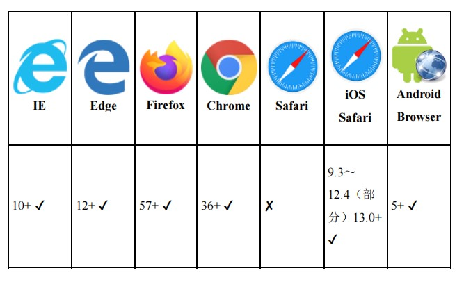

## 使用touch-action属性控制设备的触摸行为

`touch-action`属性是移动端中与手势触摸密切相关的CSS属性，它源自Windows Phone手机，属于微软系，后来被Chrome浏览器吸收借鉴，Firefox浏览器跟着支持，现在Safari浏览器也已经完全支持（iOS 13之前是部分支持），是一个在移动端可以畅行的CSS属性

### touch-action属性的常见应用

目前`touch-action`属性有两个常见的应用，下面具体介绍一下。

#### touch-action:manipulation取消300 ms的点击延时

`touch-action:manipulation`表示浏览器只允许进行滚动和持续缩放操作，所以类似双击缩放这种非标准操作就不被允许。

想当初，之所以`click`事件在移动端有`300 ms`延时，就是因为要避免点击行为和手机双击行为发生冲突。

于是，当我们设置`touch-action:manipulation`时，取消了双击行为，`300 ms`延时也就不复存在了。

因此，下面的CSS声明可以用来避免点击后浏览器延时300 ms的问题：

```CSS
html {
 touch-action: manipulation;
}
```

#### touch-action:none解决treated as passive错误

随便新建一个空白页面，运行如下`JavaScript`代码：
```JS
document.addEventListener('touchmove', function (event) {
  event.preventDefault();
});
```

在移动端模式下滑动页面，就可以看到下面这样的一大堆错误：

```YML
[Intervention] Unable to preventDefault inside passive event
listener due to target being 
treated as passive. See…
```

此时，使用下面的CSS代码可以避免报错，让touchmove事件正常执行：
```CSS
html {
  touch-action: none;
  overflow: hidden;
}
body {
  touch-action: auto;
  height: 100vh;
  position: relative;
  overflow: auto;
}
```

不过，此方法改变了默认的滚动行为，比较适合原本就需要对默认滚动行为进行重置的单页

而对于传统的网页，建议还是使用`JavaScript`，通过传递`passive:false`参数设置来解决这个问题

```JS
document.addEventListener('touchmove', function (event) {
  event.preventDefault();
}, {
  passive: false
});
```

### 了解touch-action属性各个属性值的含义

`touch-action`属性支持的属性值有：
```CSS
touch-action: auto;
touch-action: manipulation;
touch-action: none;
touch-action: pan-x;
touch-action: pan-y;
touch-action: pan-left;
touch-action: pan-right;
touch-action: pan-up;
touch-action: pan-down;
touch-action: pinch-zoom;
```

- `auto`是默认值，表示手势操作完全由浏览器决定（如`<meta>`元素的`viewport`属性通过设置`user-scalable=no/yes`来确定是否允许缩放）。
- `manipulation`表示浏览器只允许进行滚动和持续缩放操作，类似双击缩放这种非标准操作就不可以。此属性值可以用来解决点击后延时`300ms`的问题。iOS 9.3就已经支持该值。
- `none`表示不进行任何手势相关的行为，例如，你想用手指滚动网页就不行，双击放大或缩小页面也不可以，所有这些行为都要自定义。另外，从这个属性值开始，一直到最后一个属性值`pinch-zoom`，都是iOS 13才开始支持的。
- `pan-x`表示支持手指头水平移来移去的操作
- `pan-y`表示支持手指头垂直移来移去的操作
- `pan-left`表示支持手指头往左移动，移动开始后往右可以恢复的操作
- `pan-right`表示支持手指头往右移动，移动开始后往左可以恢复的操作
- `pan-up`表示支持手指头往上移动，移动开始后往下可以恢复的操作
- `pan-down`表示支持手指头往下移动，移动开始后往上可以恢复的操作
- `pinch-zoom`表示支持手指头缩放页面的操作

上述部分属性值可以组合使用

`pan-x`、`pan-left`和`pan-right`一组

`pan-y`、`pan-up`和`pan-down`一组

`pan-zoom`单独一组

```CSS
.example {
  /* 表示可以左移、上移和缩放。 */
  touch-action: pan-left pan-up pan-zoom;
}
```

这些关键字属性值适合用在需要自定义手势行为的场景下，虽不常用，但很实用

 <br>